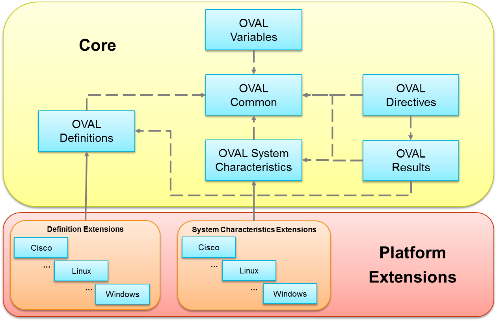

### A Guide to Extending the OVAL Language

# Contents
[Trademark Information](#trademark-information)

[Warnings](#warnings)

[Feedback](#feedback)

1. [Introduction](#1-introduction)
  1. [Prerequisites](#1-1-prerequisites)
  2. [Extension Development Process](#1-2-extension-development-process)
    1. [Identify](#1-2-1-identify)
	2. [Research](#1-2-2-research)
	3. [Implement](#1-2-3-implement)
	4. [Discuss](#1-2-4-discuss)
	5. [Refine](#1-2-5-refine)
  3. [Useful Tools and Resources for OVAL Development](#1-3-useful-tools-and-resources-for-oval-development)
    1. [Tools](#1-3-1-tools)
	2. [Resources](#1-3-2-resources)
  4. [OVAL Revision Process](#1-4-oval-revision-process)
  5. [OVAL Versioning Policy](#1-5-oval-versioning-policy)
  6. [Conventions Used in this Document](#1-6-conventions-used-in-this-document)
    1. [OVAL Design Principle](#1-6-1-oval-design-principle)
2. [Structure of the OVAL Language](#2-structure-of-the-oval-language)
  1. [OVAL Core Models](#2-1-oval-core-models)
    1. [OVAL Common Model](#2-1-1-oval-common-model)
    2. [OVAL Variables Model](#2-1-2-oval-variables-model)
    3. [OVAL Definitions Model](#2-1-3-oval-definitions-model)
    4. [OVAL System Characteristics Model](#2-1-4-oval-system-characteristics-model)
    5. [OVAL Results Model](#2-1-5-oval-results-model)
    6. [OVAL Directives Model](#2-1-6-oval-directives-model)
  2. [OVAL Platform Extension Models](#2-2-oval-platform-extension-models)
3. [Extending the OVAL Language](#3-extending-the-oval-language)
  1. [Designing an OVAL Test](#3-1-designing-an-oval-test)
    1. [Designing an OVAL Item](#3-1-1-designing-an-oval-item)
    2. [Designing an OVAL Object](#3-1-2-designing-an-oval-object)
    3. [Designing an OVAL State](#3-1-3-designing-an-oval-state)
  2. [Designing an OVAL Function](#3-2-designing-an-oval-function)
  3. [Designing an OVAL Datatype](#3-3-designing-an-oval-datatype)
    1. [Simple or Complex](#3-3-1-simple-or-complex)
    2. [Implications to Casting](#3-3-2-implications-to-casting)
    3. [Entity Type Constructs](#3-3-3-entity-type-constructs)
  4. [Designing an OVAL Enumeration](#3-4-designing-an-oval-enumeration)
  5. [Determining Where an Extension Belongs](#3-5-determining-where-an-extension-belongs)
    1. [OVAL Tests and their Corresponding Objects, States, Items](#3-5-1-oval-tests-and-their-corresponding-objects-states-items)
    2. [OVAL Function](#3-5-2-oval-function)
    3. [OVAL Datatype](#3-5-3-oval-datatype)
    4. [Other](#3-5-4-other)
4. [Naming conventions](#4-naming-conventions)
  1. [Schema Constructs](#4-1-schema-constructs)
    1. [General Conventions](#4-1-1-general-conventions)
    2. [Types](#4-1-2-types)
    3. [Enumerations](#4-1-3-enumerations)
    4. [Keys](#4-1-4-keys)
    5. [OVAL Identifier Pattern](#4-1-5-oval-identifier-pattern)
    6. [Schematron Pattern Identifier](#4-1-6-schematron-pattern-identifier)
    7. [Unique](#4-1-7-unique)
    8. [Component](#4-1-8-component)
    9. [Groups](#4-1-9-groups)
    10. [Functions](#4-1-10-functions)
    11. [Entities](#4-1-11-entities)
  2. [XML Constructs](#4-2-xml-constructs)
    1. [General Conventions](#4-2-1-general-conventions)
    2. [Tests](#4-2-2-tests)
    3. [Objects](#4-2-3-objects)
    4. [States](#4-2-4-states)
    5. [Items](#4-2-5-items)
    6. [Object, State, and Item Entities](#4-2-6-object-state-and-item-entities)
    7. [Functions](#4-2-7-functions)
    8. [Datatypes](#4-2-8-datatypes)
    9. [Enumerations](#4-2-9-enumerations)
5. [OVAL Extension Checklist](#5-oval-extension-checklist)
  1. [Submitting a New OVAL Component Schema](#5-1-submitting-a-new-oval-component-schema)
  2. [Submitting a New OVAL Core Capability](#5-2-submitting-a-new-oval-core-capability)
  3. [Submitting a New OVAL Test](#5-3-submitting-a-new-oval-test)
  4. [Submitting a New OVAL Entity](#5-4-submitting-a-new-oval-entity)
  5. [Adding a New OVAL Function](#5-5-adding-a-new-oval-function)
  6. [Requests to Modify Existing OVAL Constructs](#5-6-requests-to-modify-existing-oval-constructs)
  7. [Requests to Deprecate OVAL Constructs](#5-7-requests-to-deprecate-oval-constructs)
  8. [Filling out the OVAL Proposal Form](#5-8-filling-out-the-oval-proposal-form)
6. [Sharing OVAL Language Extensions](#6-sharing-oval-language-extensions)

## Trademark Information
Open Vulnerability and Assessment Language (OVAL) and the OVAL logo are trademarks of the United States Government under license from the United States Department of Homeland Security (DHS).  All other trademarks are property of their respective owners.

## Warnings
ALL DOCUMENTS AND THE INFORMATION CONTAINED THEREIN ARE PROVIDED ON AN "AS IS" BASIS AND THE CONTRIBUTOR, THE ORGANIZATION HE/SHE REPRESENTS OR IS SPONSORED BY (IF ANY), THE CENTER FOR INTERNET SECURITY, INC., ITS DIRECTORS, OFFICERS, EMPLOYEES, CONTRACTORS, AND AGENTS, AND THE UNITED STATES GOVERNMENT DISCLAIMS ALL WARRANTIES, EXPRESS OR IMPLIED, INCLUDING BUT NOT LIMITED TO ANY WARRANTY THAT THE USE OF THE INFORMATION THEREIN WILL NOT INFRINGE ANY RIGHTS OR ANY IMPLIED WARRANTIES OF MERCHANTABILITY OR FITNESS FOR A PARTICULAR PURPOSE.<sup id="a1">[1](#f1)</sup>

## Feedback
All feedback regarding the OVAL Developer’s Guide is welcome.  Please send any comments, questions, or suggestions to the public OVAL Developer’s Forum at oval_developer@lists.cisecurity.org.

## 1 Introduction
The development of the OVAL Language has primarily been a community-driven effort over its 12+ year history representing the work of a broad and diverse community of organizations and individuals representing industry, government, and academia.  Over the years, the OVAL Language has evolved and matured with design decisions and conventions being refined to account for the lessons learned by the community.  Unfortunately, the knowledge of these design decisions and conventions are dispersed across a variety of documents on the OVAL website, the OVAL Developer's List, and the collective knowledge and experiences of the community and is not captured in a single location.  This makes developing new extensions for OVAL especially challenging for newer members of the community and has led to some inconsistencies in the application of design principles and conventions over the years.

This guide aims to capture key design decisions and conventions in a single location and help the community to advance the OVAL Language to meet their future needs.  Specifically, this guide discusses the process of creating OVAL extensions, the structure of the OVAL Language, the key extension points and the design principles and conventions to consider when developing extensions.  Over time, the community may want to capture additional design decisions and conventions in this document to further improve the process of developing extensions to the OVAL Language.

### 1.1 Prerequisites
To develop OVAL extensions, it requires not only the ability to read, understand, and write eXtensible Markup Language (XML), XML Schema, and Schematron rules, but, also have the domain expertise for the target platforms and the ability to read and understand the documentation provided by the primary source vendor (e.g. system-level API documentation, etc.).  As a result, primary source vendors and tool developers are typically best suited to develop extensions for OVAL.

### 1.2 Extension Development Process
Over time, as existing platforms evolve and new platforms emerge, the OVAL Language must be updated to support these changes in order to remain a viable option for assessing endpoints.  The process for developing OVAL extensions can typically be broken up into five logical steps: (1) Identify, (2) Research, (3) Implement, (4) Discuss, and (5) Refine.

#### 1.2.1 Identify
The first step in developing an OVAL extension is to identify a gap in the OVAL Language whether it is a new OVAL Test to check a particular piece of posture attribute data on a platform or an OVAL Function that allows for a new way to manipulate posture attribute data collected off of an endpoint.  Once a gap has been identified, it is important to develop the justification for making the change to the OVAL Language.  This helps other members of the community understand why the change is needed and also helps to scope the change to only include what is needed.  In doing so, it is important to determine which models will be affected so it will be possible to understand the impact of the change to existing content and tools and whether or not existing capabilities need to be deprecated in favor of the new or improved capabilities.  This also helps determine whether or not a change is permitted in a particular release of the OVAL Language.

#### 1.2.2 Research
This is typically the most challenging part of developing an OVAL extension because it often times requires digging into primary source vendor documentation which may vary greatly from platform to platform with regards to quality and completeness.  When researching a new capability there are a variety of things that need to be accounted for depending on the type of change.  Most importantly, what the data should look like.  This typically occurs at two levels, how the construct should be represented in the OVAL Language and how the data contained within that OVAL Language construct should be represented.  Next, boundary and error conditions must be determined for the new capability.  Understanding what the data needs to look like and the boundary and error conditions are critical for tool developers and content authors to be able to consistently develop tools and content that align with the intended use of the extension.  In addition to determining what the data should look like, it is also very important to figure out if there are special algorithms that must be followed to obtain the data and what APIs or other collection mechanisms are available to gather the relevant data.  However, it should be noted that while it is encouraged to provide information on how this data may be collected, new capabilities should not dictate implementation as that should be left for the tool developer to decide.  Lastly, it is important to research the new capability enough so as to be able to highlight any caveats or special considerations regarding the change so that the community, when reviewing the change, can make an informed decision.

#### 1.2.3 Implement
Assuming the new change was thoroughly researched, the implementation step should be relatively straight forward.  First, the changes must be represented in XML Schema.  In the OVAL Language, most OVAL Tests, Objects, States, Items, and Functions all follow the same format so chances are existing constructs can be used as a template for creating new ones.  In doing so, it is very important to follow the design principles and best practices outlined below as well as provide thorough documentation capturing all of the information in the research step.  Next, it is important to create sample content that demonstrates the use cases provided in the justification for the new change.  This will give others in the community a feel for what the change looks like.  If possible, sample code should also be provided in order to demonstrate that the capability is actually implementable.  Unfortunately, there have been times when changes were made to the OVAL Language, prior to being implemented, and it was later determined that the changes were not actually implementable in practice.  Lastly, the changes should be committed to the OVAL Sandbox<sup id="a2">[2](#f2)</sup> so that they will be available in a central location for the community to review.

#### 1.2.4 Discuss
In order to begin the discussion of a newly developed change in the OVAL Language, an OVAL Proposal Form<sup id="a3">[3](#f3)</sup> should be completed.  The form will describe the new capability, why it is needed, identify the targeted release, document the benefits, impact, and concerns around the change, provide statements about the technical quality of the proposal, and provide links to related resources.  Overall, the proposal form is intended to provide the community with an overview of the changes in a single document.  Once complete, this form should be sent to the OVAL Developer's List for community review and discussion.

#### 1.2.5 Refine
Over the period of community discussion, there may be questions, concerns, or feedback provided by the community.  In this stage, it is important to work through this and refine the extension as needed to address the needs and concerns of the community.  Once the community feels that the changes are ready for inclusion in the OVAL Language, the proposal should be sent to the OVAL Board for review, discussion, and a vote.  If the proposal is approved, the changes will be made to the OVAL Language.  If the proposal is not approved, it may be necessary to make additional changes to the proposal before it is approved.

### 1.3 Useful Tools and Resources for OVAL Development
Before developing extensions to the OVAL Language, it is important to be aware of the tools and resources that have been helpful in the OVAL community developing extensions over the years.  

#### 1.3.1 Tools

##### 1.3.1.1 XML Editor
While you may use a text editor to develop extensions to the OVAL Language, an XML editor provides many capabilities such as syntax highlighting, validation, auto-complete, and ability to apply eXstensible Stylesheet Language Transformations (XSLT) transforms that will make developing extensions that much easier.  You can find a list of XML editors and a comparison of their capabilities on Wikipedia<sup id="a4">[4](#f4)</sup>.

##### 1.3.1.2 Git Client
The development OVAL Language schemas are currently hosted on GitHub.  A git client can be used to check out a local copy of the latest schemas.  A list of git clients can be found here<sup id="a5">[5](#f5)</sup>.

##### 1.3.1.3 Ability to Apply XSLT Transforms
While the ability to apply XSLT transforms is not critical, MITRE has developed an XSLT transform<sup id="a6">[6](#f6)</sup> that goes through and checks OVAL schemas for common errors such as missing OVAL Objects, State, Items, and Entities as well as checks the minOccurs and maxOccurs attributes among other things.  XML editors will typically provide the ability to apply XSLT transforms, but, you may also use other command line tools and libraries.  There are a variety of tools that have the ability to apply XSLTs and you can find a list of software that implements XSLT processors here<sup id="a7">[7](#f7)</sup>. 

#### 1.3.2 Resources

##### 1.3.2.1 OVAL Language Specification and Schemas
The authoritative source of information for the OVAL Language is contained within the OVAL Language specifications<sup id="a8">[8](#f8)</sup> and the OVAL schema documentation<sup id="a9">[9](#f9)</sup>.  The specifications for the core models and subset of extension models, that have been developed, should be consulted first with the schema documentation being used to fill any gaps in the specifications. 

##### 1.3.2.2 OVAL Developer’s List and Archives
Much of the work that has been done on the OVAL Language has occurred on the OVAL Developer's List which is a public mailing list where the community can propose and discuss extensions as well as ask questions about the OVAL Language.  While previously hosted by MITRE, the OVAL Developer's List is now hosted by the Center for Internet Security.  You can sign up for the mailing list here<sup id="a10">[10](#f10)</sup>.  If you have questions about designing an OVAL extension, you can always ask the community for help.  Similarly, you may also find useful information about developing extensions by looking at design decisions made for previous proposals by examining MITRE OVAL Developer's List archives<sup id="a11">[11](#f11)</sup> and the CIS OVAL Developer's List archives<sup id="a12">[12](#f12)</sup>.

##### 1.3.2.3 Primary Source Vendor Documentation
When developing extensions in OVAL, it will often times require researching a particular vendor platform in order to determine the type of information that needs to be collected, collection mechanisms that can be used to retrieve data off of an endpoint, and to understand what the data should look like.  Since the primary source vendors are the authoritative source of information for their platforms, it is recommended that documentation and references from their resources are used when developing extensions for OVAL.

### 1.4 OVAL Revision Process
The OVAL Revision Process describes the process by which the OVAL Language changes and evolves including the major milestones for creating a new version of the OVAL Language.  More information about the OVAL Language Revision Process can be found here<sup id="a13">[13](#f13)</sup>.

### 1.5 OVAL Versioning Policy
The OVAL Versioning Policy defines the methodology used to version the OVAL Language including what revisions constitute a major, minor, or update change as well as how the core and platform models of the OVAL Language are versioned with respect to each other.  More information about the OVAL Language Versioning Policy can be found here<sup id="a14">[14](#f14)</sup>.

### 1.6 Conventions Used in this Document
The following font and font style conventions are used throughout the remainder of this document:

* The <span style="font-family: 'Courier New'">Courier New</span> font is used for writing constructs in the OVAL Language Data Model.
		Example: <span style="font-family: 'Courier New'">file_test</span>

#### 1.6.1 OVAL Design Principle
Much of this document will be discussing the various design principles to consider and use when developing extensions to the OVAL Language.  These principles are critical to developing quality extensions that can be used by the rest of the community.  In the document, design principles are highlighted in **bold** text.  For example:

  **An OVAL Item MUST model the posture attribute data being collected off an endpoint.**

## 2 Structure of the OVAL Language
The foundation of the OVAL Language consists of a set of Core Models that establish the logical framework for making assertions about the posture of an endpoint by providing building blocks for representing the expected state of an endpoint, the actual state of an endpoint, and results of the analysis between the two.  This foundation is supplemented by numerous Platform Extension Models that extend the Core Models to support different platforms.  In the following diagram, extension points are represented by solid arrows and where one model leverages another model is represented by a dotted arrow.          



### 2.1 OVAL Core Models

#### 2.1.1 OVAL Common Model
The OVAL Common Model exists to facilitate the reuse of constructs and enumerations that are leveraged through the rest of the OVAL Language Data Model.  Typically, if a construct or enumeration is used in two or more models, it is placed in the OVAL Common Model.  

#### 2.1.2 OVAL Variables Model
The OVAL Variables Data Model defines all the constructs needed to represent a set of OVAL Variables that can be used to externally specify values that can tailor content based on the OVAL Definitions Model at run-time.  This tailoring can be applied to both the identification of what posture attribute data to examine as well as the actual state of that posture attribute data.

#### 2.1.3 OVAL Definitions Model
The OVAL Definitions Model defines an extensible framework for making assertions about an endpoint based upon a collection of logical statements.  Each logical statement defines an expected state of the endpoint by specifying the posture attribute data to examine on the endpoint as well as the expected state of that posture attribute data.  The OVAL Definitions Model contains the constructs used to extend the OVAL Language to support new OVAL Tests, OVAL Objects, OVAL States, and OVAL Functions among other things.

#### 2.1.4 OVAL System Characteristics Model
The OVAL System Characteristics Model defines an extensible framework for representing low-level posture attribute data that can be collected from an endpoint.  This includes data such as operating system properties, installed software, settings of installed software, and operating system security settings among other data.  The posture attribute data captured in the OVAL System Characteristics Model can be used to compare the actual state of the posture attribute data on the endpoint against the expected state of the posture attribute data described in the OVAL Definitions document.  The OVAL System Characteristics Model contains the constructs used to extend the OVAL Language to support new OVAL Items used to represent the actual posture attribute data collected off of an endpoint.

#### 2.1.5 OVAL Results Model
The OVAL Results Model is used to report the results of an evaluation of a set of endpoints based upon a set of OVAL Definitions and OVAL System Characteristics.  In this way, the OVAL Results Model provides detailed information about the set of assertions that were evaluated, the observed states of the evaluated endpoints, and the detailed results of the evaluation.  This model enables applications to consume this data, interpret it, and take the necessary actions to report on the evaluation results or take other actions.  The level of detail in content based on the OVAL Results Model can be tailored using the OVAL Directives Model.

#### 2.1.6 OVAL Directives Model
The OVAL Directives Model defines the constructs that can be used to specify the level of detail to include content based on the OVAL Results Model.  

### 2.2 OVAL Platform Extension Models
The Core Models above provide a variety of extension points which can be extended to support OVAL on specific platforms (e.g. Cisco IOS, Google Android, Linux, Microsoft Windows, etc.) where each platform gets its own OVAL Definitions Model and OVAL System Characteristics Model.  The Platform OVAL Definitions Models include the OVAL Tests, Objects, and States for the specific platforms whereas the Platform OVAL System Characteristics Models include the OVAL Items for the specific platform.  

## 3 Extending the OVAL Language
The Core Models of the OVAL Language define a set of core capabilities, as described within the OVAL Language Specification, with numerous extension points. This section highlights the opportunities for extension within the Core Models of the OVAL Language as well as the design principles and best practices to follow when doing so.  Specifically, this includes extending the OVAL Language to include a new OVAL Test, OVAL Function, OVAL Datatype, and OVAL Type Enumeration as well as where an extension should be placed in the OVAL Language Data Model.

### 3.1 Designing an OVAL Test
OVAL Tests serve as the mechanism for combining an OVAL Object (what data to collect) with one or more OVAL States (the expected state of the collected data).  When creating a new OVAL Test in an OVAL Platform Extension Model, the OVAL Test must extend the abstract OVAL Definitions Model <span style="font-family: 'Courier New'">oval-def:TestType</span> construct.  Creating a new OVAL Test is quite straight forward and is as simple as taking an existing OVAL Test from the schema, copying it, pasting it, and then modifying it.  The majority of the real work is in designing the OVAL Object and OVAL Item.  All OVAL Tests are exactly the same with the exception of a few minor details.  First, is the documentation associated with the OVAL Test.  Each OVAL Test should have documentation that explains what it does.  Next, the <span style="font-family: 'Courier New'">oval:element_mapping</span> construct, which documents the OVAL Object, State, and Item that is associated with the OVAL Test, needs to be updated appropriately.  Lastly, the Schematron rules that ensure that the OVAL Test references an OVAL Object and OVAL States of the correct type needs to be updated to reflect the new constructs.  

Below is the schema for the <span style="font-family: 'Courier New'">win-def:file_test</span> which demonstrates a typical OVAL Test in the OVAL Language.

```xml
01<xsd:element name="file_test" substitutionGroup="oval-def:test">
02    <xsd:annotation>
03        <xsd:documentation>The file test is used to check metadata associated with Windows files. It extends the standard TestType as defined in the oval-definitions-schema and one should refer to the TestType description for more information. The required object element references a file_object and the optional state element specifies the metadata to check.</xsd:documentation>
04        <xsd:appinfo>
05            <oval:element_mapping>
06                <oval:test>file_test</oval:test>
07                <oval:object>file_object</oval:object>
08                <oval:state>file_state</oval:state>
09                <oval:item target_namespace="http://oval.mitre.org/XMLSchema/oval-system-characteristics-5#windows">file_item</oval:item>
10            </oval:element_mapping>
11        </xsd:appinfo>
12        <xsd:appinfo>
13            <sch:pattern id="win-def_filetst">
14                <sch:rule context="win-def:file_test/win-def:object">
15                    <sch:assert test="@object_ref=ancestor::oval-def:oval_definitions/oval-def:objects/win-def:file_object/@id"><sch:value-of select="../@id"/> - the object child element of a file_test must reference a file_object</sch:assert>
16                </sch:rule>
17                <sch:rule context="win-def:file_test/win-def:state">
18                    <sch:assert test="@state_ref=ancestor::oval-def:oval_definitions/oval-def:states/win-def:file_state/@id"><sch:value-of select="../@id"/> - the state child element of a file_test must reference a file_state</sch:assert>
19                </sch:rule>
20            </sch:pattern>
21        </xsd:appinfo>
22    </xsd:annotation>
23    <xsd:complexType>
24        <xsd:complexContent>
25            <xsd:extension base="oval-def:TestType">
26                <xsd:sequence>
27                    <xsd:element name="object" type="oval-def:ObjectRefType"/>
28                    <xsd:element name="state" type="oval-def:StateRefType" minOccurs="0" maxOccurs="unbounded"/>
29                </xsd:sequence>
30            </xsd:extension>
31        </xsd:complexContent>
32    </xsd:complexType>
33</xsd:element>
```

The schema for win-def:file_test<sup id="a15">[15](#f15)</sup>

The following table goes through the schema line-by-line and details the modifications required to create a new OVAL Test.  For simplicity, the OVAL Test’s name “file” is replaced with “[\*]”.
<table>
  <tr>
    <th>Line(s)</th>
    <th>What changes?</th>
  </tr>
  <tbody>
    <tr>
      <td>01</td>
      <td>The <span style="font-family: 'Courier New'">name</span> attribute is assigned a value of “[*]_test” in accordance with <a href="#4-2-2-tests">Section 4.2.2</a>.</td>
    </tr>
    <tr>
      <td>03</td>
      <td>The <span style="font-family: 'Courier New'">documentation</span> element describes what endpoint metadata this particular OVAL Test is designed to collect and evaluate.  Any necessary clarifications to the scope of this OVAL Test should be provided here. </td>
    </tr>
	<tr>
      <td>05-09</td>
      <td>The <span style="font-family: 'Courier New'">element_mapping</span> construct explicitly correlates the associated OVAL Test, Object, State, and Item constructs and must always be present.
	<br/><br/>In most cases, the relevant OVAL Test name should be used to update the test, object, state, and item components of the <span style="font-family: 'Courier New'">element_mapping</span> construct with [*]_test, [*]_object, [*]_state, and [*]_item. With that said, it is important to note that it is also possible to map new OVAL Tests to existing OVAL Items as exemplified with the <span style="font-family: 'Courier New'">win-def:fileeffectiverights53_test</span> and <span style="font-family: 'Courier New'">win-sc:fileeffectiverights_item</span>.
	<br/><br/>The <span style="font-family: 'Courier New'">target_namespace</span> attribute identifies the namespace URI of the platform-specific OVAL System Characteristics Model associated with the OVAL Test.</td>
    </tr>
	<tr>
      <td>13-20</td>
      <td>All OVAL Tests have their own Schematron rules for verifying that they only reference the associated OVAL Objects and States as defined in the <span style="font-family: 'Courier New'">element_mapping</span>. Please adhere to Schematron best practices when defining these rules.</td>
    </tr>
	<tr>
      <td>23-32</td>
      <td>This <span style="font-family: 'Courier New'">complexType</span> element must always be present and verbatim for every OVAL Test. Every OVAL Test extends the <span style="font-family: 'Courier New'">oval-def:TestType</span> construct and contains one <span style="font-family: 'Courier New'">object</span> element followed by zero or more <span style="font-family: 'Courier New'">state</span> elements.</td>
    </tr>
  </tbody>
</table>

#### 3.1.1 Designing an OVAL Item
The first step in designing a new OVAL Item for the OVAL Language is to determine what posture attribute data needs to be collected off of an endpoint as well as justification for doing so.  In its simplest form, an OVAL Item is a logical set of entities that model posture attribute data collected from an endpoint.  Typically, this posture attribute data consists of information that uniquely identifies the system structure on the endpoint as well as additional metadata about that system structure that may need to be assessed.  This could be a registry key on a Windows endpoint, a process on a UNIX endpoint, or an installed RPM on a Red Hat Linux endpoint.  Each OVAL Item should have a name that follows the conventions in [Section 4.2.5](#4-2-5-items) and extends the abstract <span style="font-family: 'Courier New'">oval-sc:ItemType</span> construct in the OVAL System Characteristics Model.  Below is an excerpt from the schema for the <span style="font-family: 'Courier New'">win-sc:file_item</span> which demonstrates a typical OVAL Item in the OVAL Language.

```xml
01<xsd:element name="file_item" substitutionGroup="oval-sc:item">
02    <xsd:annotation>
03        <xsd:documentation>This element describes file metadata. The time information can be retrieved by the _stat function. Development_class and other version information (company, internal name, language, original_filename, product_name, product_version) can be retrieved using the VerQueryValue function.</xsd:documentation>
04    </xsd:annotation>
05    <xsd:complexType>
06        <xsd:complexContent>
07            <xsd:extension base="oval-sc:ItemType">
08                <xsd:sequence>
09                    ...
10                    <xsd:element name="filename" type="oval-sc:EntityItemStringType" minOccurs="0" maxOccurs="1" nillable="true">
11                        <xsd:annotation>
12                            <xsd:documentation>The name of the file. If the xsi:nil attribute is set to true, then the item being represented is the higher directory represented by the path entity. The other items associated with this item would then reflect the values associated with the directory.</xsd:documentation>
13                        </xsd:annotation>
14                    </xsd:element>
15                    ...
16                    <xsd:element name="size" type="oval-sc:EntityItemIntType" minOccurs="0" maxOccurs="1">
17                        <xsd:annotation>
18                            <xsd:documentation>Size of the file in bytes.</xsd:documentation>
19                        </xsd:annotation>
20                    </xsd:element>
21                  ...
22                    <xsd:element name="type" type="win-sc:EntityItemFileTypeType" minOccurs="0" maxOccurs="1">
23                        <xsd:annotation>
24                            <xsd:documentation>The type child element marks whether the file item describes a directory, named pipe, standard file, etc.
 These types are the return values for GetFileType, with the exception of FILE_ATTRIBUTE_DIRECTORY which is obtained by looking at GetFileAttributesEx.</xsd:documentation>
25                        </xsd:annotation>
26                    </xsd:element>
27                  ...
28                    <xsd:element name="windows_view" type="win-sc:EntityItemWindowsViewType" minOccurs="0">
29                        <xsd:annotation>
30                            <xsd:documentation>The windows view value from which this OVAL Item was collected. This is used to indicate from which view (32-bit or 64-bit), the associated Item was collected. A value of '32_bit' 
indicates the Item was collected from the 32-bit view. A value of '64-bit' indicates the Item was collected from the 64-bit view. Omitting this entity removes any assertion about which view the Item was collected from, and 
therefore it is strongly suggested that this entity be set.</xsd:documentation>
31                        </xsd:annotation>
32                    </xsd:element>
33                </xsd:sequence>
34            </xsd:extension>
35        </xsd:complexContent>
36    </xsd:complexType>
37</xsd:element>
```

Truncated schema for win-sc:file_item<sup id="a16">[16](#f16)</sup>

Please consult the following table which details the modifications required to form a new OVAL Item using the sample schema.  For simplicity, the OVAL Item’s name “file” is replaced with “[\*]”.

<table>
  <tr>
    <th>Line(s)</th>
    <th>What changes?</th>
  </tr>
  <tbody>
    <tr>
      <td>01</td>
      <td>The <span style="font-family: 'Courier New'">name</span> attribute is assigned a value of “[*]_item” in accordance with <a href="#4-2-5-items">Section 4.2.5</a>.</td>
    </tr>
    <tr>
      <td>03</td>
      <td>The <span style="font-family: 'Courier New'">documentation</span> element describes how metadata may be retrieved from the endpoint. This should not limit implementations, but rather guide them towards examples of your intended metadata and potential methods of collection.</td>
    </tr>
	<tr>
      <td>05-08</td>
      <td>The <span style="font-family: 'Courier New'">complexType ... sequence</span> elements enforce the ordering of OVAL Item Entities in an OVAL Item.  It is important that the ordering of OVAL State Entities match the ordering of OVAL Item Entities.</td>
    </tr>
	<tr>
      <td>10</td>
      <td>Each OVAL Item Entity should be represented as an <span style="font-family: 'Courier New'">element</span> with a unique name. If an OVAL Item Entity is capable of having multiple values, it should be represented by multiple occurrences of the element which can be permitted by setting the <span style="font-family: 'Courier New'">maxOccurs</span> attribute to “unbounded”.  The default value for the attribute is “1”.  The <span style="font-family: 'Courier New'">minOccurs</span> attribute must always be set to “0” to allow OVAL Item entities to be omitted at the discretion of an OVAL System Characteristics Producer.  The <span style="font-family: 'Courier New'">type</span> attribute is used to specify what data format should be used to parse the returned Item entity value.  The list of permitted OVAL datatypes is found in the <span style="font-family: 'Courier New'">oval:DatatypeEnumeration</span> construct in the OVAL Common Model.  These datatypes are utilized with the available <span style="font-family: 'Courier New'">oval-sc:EntityItem[...]Type</span> constructs defined in the OVAL System Characteristics Model.  Additional datatypes, unique to a platform, may also be present in the appropriate platform-specific OVAL System Characteristics Model.  If the <span style="font-family: 'Courier New'">nillable</span> attribute is set to “true”, then ensure that the appropriate use cases, as defined in the corresponding OVAL Object Entity, are described in the <span style="font-family: 'Courier New'">documentation</span> element. </td>
    </tr>
	<tr>
      <td>11-12</td>
      <td>Each OVAL Item Entity should have a descriptive <span style="font-family: 'Courier New'">documentation</span> element that concisely describes what the element represents, and provide any units necessary for interpretation.  Possible entity values should be explained when they may be ambiguous or represent special cases.  One such example is the <span style="font-family: 'Courier New'">win-sc:registry_item</span>, where an empty string value for the name entity, denotes the default value of the key should be collected.</td>
    </tr>
	<tr>
      <td>22,28</td>
      <td>These OVAL Item Entities show the use of a custom datatype defined in this platform-specific OVAL System Characteristics Model.  Note the XML namespace prefix specifies the platform-specific model where the type is defined.</td>
    </tr>
  </tbody>
</table>

**Design Principle: An OVAL Item MUST model the posture attribute data that is being collected from an endpoint**

This design principle is probably the most important when extending the OVAL Language to support a new OVAL Test because it ensures that the test is modeled after a platform system structure and not after some specific collection mechanism that may limit the flexibility of OVAL-capable tools to collect the posture attribute data off an endpoint as well as well as potentially hurting the extensibility of the OVAL Item in the future.  Examples of system structures that would be good to model OVAL Items after include:

* Files
* Interfaces
* Registry keys
* User and group accounts
* Packages
* Access control lists
* Services
* Complex file formats
* Processes
* Logical groups of settings (e.g. password complexity, etc.)

Typically, these system structures have a way to uniquely identify them on the endpoint whether there is a single unique identifier (e.g. process identifier, security identifier, etc.) or a collection of identifiers (e.g. path and filename for a file, hive, key, and name for a registry key, etc.) and can usually be derived from how the platform identifies these constructs in system-level APIs, command line tools, and graphical interfaces.  Beyond that, these system structures also have metadata that the vendor exposes which can make up the rest of an OVAL Item.  This metadata might include things like account privileges, file sizes, registry key values, arguments process arguments among other things.

Two great examples of why it is important to follow this design principle are the <span style="font-family: 'Courier New'">macos-sc:diskutil_item</span> and the <span style="font-family: 'Courier New'">macos-sc:passwordpolicy59_item</span>.  Unfortunately, both OVAL Items are based off of command line utilities (diskutil(8) and pwpolicy(8)) with OVAL Item entities mirroring arguments taken by the utility.  As a result, it almost limits tool developers to use the respective commands to collect the information (unless the system-level APIs take the same arguments) or at best strongly suggests that the command should be used although OVAL is not supposed to dictate how the information is collected as long as it is accurate.  Furthermore, the <span style="font-family: 'Courier New'">macos-def:diskutil_item</span> only provides information about the verification of permissions on an endpoint even though the diskutil command on Mac OSX provides many more capabilities.  If it was ever decided to add support for these capabilities, the OVAL Test would quickly become very complicated and cumbersome.  Better examples of OVAL Items that follow this design principle include the <span style="font-family: 'Courier New'">win-sc:registry_item</span>, <span style="font-family: 'Courier New'">win-sc:file_item</span>, and <span style="font-family: 'Courier New'">unix-sc:process_item</span> among others where they all model a specific system-level structure on the endpoint and are supplemented by metadata about those structures.

It should also be noted that there have been a few cases over the years (<span style="font-family: 'Courier New'">win-sc:cmdlet_item</span>, <span style="font-family: 'Courier New'">win-sc:wmi_item</span>, and the <span style="font-family: 'Courier New'">netconf-sc:config_item</span>) where the OVAL Language was extended to support specific collection mechanisms in defiance of this design principle albeit undocumented at the time.  In these cases, the community believed that the benefits of adding these tests would outweigh breaking the design principle.  Specifically, providing access to these large data stores would address the short-term needs of the community while new OVAL Items that better align with this design principle would be developed and incorporated into an official release.  Moving forward, it may make sense to add a few more OVAL Items that model collection mechanisms, but, it should be thoroughly discussed first and should be the exception to the rule.

**Design Principle: An OVAL Item MUST NOT combine multiple system-level structures**
 
When designing a new OVAL Item, it is sometimes tempting to overload the OVAL Item to cover all of the system-level structures especially if the metadata being collected about each is the same.  This should not be done because it introduces additional and unnecessary complexity when it comes to designing the OVAL Object and OVAL Item.  A good example of this is the <span style="font-family: 'Courier New'">linux-sc:selinuxsecuritycontext_item</span> which includes the <span style="font-family: 'Courier New'">filepath</span>, <span style="font-family: 'Courier New'">path</span>, and <span style="font-family: 'Courier New'">filename</span> entities for collecting the SELinux security context of a file and the <span style="font-family: 'Courier New'">pid</span> entity for collecting the SELinux security context of a process.  Due to this design, the corresponding OVAL Object needed to include a choice between <span style="font-family: 'Courier New'">filepath</span>, <span style="font-family: 'Courier New'">path</span> and <span style="font-family: 'Courier New'">filename</span>, and <span style="font-family: 'Courier New'">pid</span> as well as behaviors to control how files are collected off of the endpoint.  This additional complexity can introduce opportunities for confusion for content authors who try to write content for the test as well as may potentially make it more difficult for tool developers to implement in their products.  A better design for this OVAL Item would be to break it out into two separate OVAL Items: one for collecting the SELinux security context of files and another for collecting the SELinux security context of processes.  This would reduce complexity in the corresponding OVAL Objects and OVAL Items and avoids even messier constructs if it was ever decided that the OVAL Language should be extended to support the collection of security contexts associated with other system structures (network interfaces, ports, etc.).  A few examples of OVAL Items that follow this design principle are the various effective rights and audit permissions items, in the Windows Platform Extension Model, where an OVAL Item exists for each of the different system-level structures (e.g. registry, file, service, etc.).  Another example of an OVAL Test that doesn't align with this design principle is the <span style="font-family: 'Courier New'">unix-def:gconf_object</span> which supports the collection of GConf data either from an XML file or from the GConf daemon.  In retrospect, there should really be two GConf related tests.  One for accessing the data via an XML file and another for accessing the data via the daemon.

**Design Principle: OVAL Items SHOULD only include the OVAL Entities that the community requires**

As platforms evolve and emerge, the OVAL Language must keep pace in order to provide the community with a robust assessment format, however, this must be carefully balanced with over developing the OVAL Language and filling it with features that no one in the community will ever use.  That is, just because something can be collected off of an endpoint, it doesn’t mean that it needs to be collected off of an endpoint.  With the revised OVAL Language Versioning Policy that allows for the models to be versioned independently, it should be much easier to add new features, in a timely fashion, as they are needed in the future.  

##### 3.1.1.1 Designing an OVAL Item Entity
When designing an OVAL Item Entity, a name should be selected that follows the naming conventions for XML Constructs ([Section 4.2.6](#4-2-6-object-state-and-item-entities)).  From there, an entity type must be selected from the OVAL System Characteristics Model (e.g.  <span style="font-family: 'Courier New'">oval-sc:EntityItemStringType</span>, <span style="font-family: 'Courier New'">oval-sc:EntityItemIntType</span>, <span style="font-family: 'Courier New'">oval-sc:EntityItemVersionType</span>, etc.) or an enumeration of string values must be created in the corresponding platform-specific OVAL System Characteristics Model.  If none of the existing entity types apply and an enumeration of string values is not appropriate then it may make sense to add a new datatype to the OVAL Language in accordance with [Section 4.2.8](#4-2-8-datatypes).   Next, the entity should be assigned a minOccurs=”0” and a maxOccurs=”1” or “unbounded” if multiple values may be present for a particular entity.  Every entity has a minOccurs=”0” so that tools can leave it out if they so choose (e.g. for optimization reasons, etc.).  It must be determined if the entity should be nillable.  This is driven by the design of the OVAL Object Entities and whether or not they are nillable which is described in [Section 3.1.2.1.1](#3-1-2-1-1-nillable-oval-object-entities).  Lastly, the entity should be documented to include what the entity is and potential approaches on how it could be collected to provide hints to content authors and tool implementers.

#### 3.1.2 Designing an OVAL Object
In the OVAL Language, the OVAL Object defines what posture attribute data should be collected off an endpoint for evaluation.  It does so by providing a set of OVAL Entities that uniquely identify a system structure on an endpoint (e.g. files, registry keys, processes, etc.) as well as potentially behaviors that further refine the set of OVAL Items to collect.  Within an OVAL Platform Extension Model, an OVAL Object must extend the abstract OVAL Definitions Model <span style="font-family: 'Courier New'">oval-def:ObjectType</span> construct and provide documentation about how the OVAL Object works.  An OVAL Object may require zero or more entities to uniquely identify an OVAL Item.  If it has zero entities (e.g. <span style="font-family: 'Courier New'">win-def:passwordpolicy_test</span>, <span style="font-family: 'Courier New'">ind-def:family_test</span>, etc.), it means that there is only a single OVAL Item on the endpoint for that OVAL Object.  If this is the case, the <span style="font-family: 'Courier New'">oval-def:Set</span> and <span style="font-family: 'Courier New'">oval-def:Filter</span> constructs must not be included since there are no sets of OVAL Items to combine or filter.  On the other hand, if an OVAL Object has one or more entities, the <span style="font-family: 'Courier New'">oval-def:Set</span> and <span style="font-family: 'Courier New'">oval-def:Filter</span> must be included as well as a Schematron rule to ensure that any OVAL States that are referenced in filter constructs are of the correct type.  Lastly, an OVAL Object may optionally define a set of behaviors.  These behaviors are used to better direct one or more aspects of how the required posture attribute data is collected from the endpoint.  Below is the schema for the <span style="font-family: 'Courier New'">win-def:file_object</span> which demonstrates a typical OVAL Object in the OVAL Language.

```xml
01<xsd:element name="file_object" substitutionGroup="oval-def:object">
02    <xsd:annotation>
03        <xsd:documentation>The file_object element is used by a file test to define the specific file(s) to be evaluated. The file_object will collect directories and all Windows file types (FILE_TYPE_CHAR, FILE_TYPE_DISK, FILE_TYPE_PIPE, FILE_TYPE_REMOTE, and FILE_TYPE_UNKNOWN). Each object extends the standard ObjectType as defined in the oval-definitions-schema and one should refer to the ObjectType description for more information. The common set element allows complex objects to be created using filters and set logic. Again, please refer to the description of the set element in the oval-definitions-schema.</xsd:documentation>
04        ...
05      <xsd:appinfo>
06            <sch:pattern id="win-def_file_object_verify_filter_state">
07                <sch:rule context="win-def:file_object//oval-def:filter">
08                    <sch:let name="parent_object" value="ancestor::win-def:file_object"/>
09                    <sch:let name="parent_object_id" value="$parent_object/@id"/>
10                    <sch:let name="state_ref" value="."/>
11                    <sch:let name="reffed_state" value="ancestor::oval-def:oval_definitions/oval-def:states/*[@id=$state_ref]"/>
12                    <sch:let name="state_name" value="local-name($reffed_state)"/>
13                    <sch:let name="state_namespace" value="namespace-uri($reffed_state)"/>
14                    <sch:assert test="(($state_namespace='http://oval.mitre.org/XMLSchema/oval-definitions-5#windows') and ($state_name='file_state'))">State referenced in filter for <sch:value-of select="name($parent_object)"/> '<sch:value-of select="$parent_object_id"/>' is of the wrong type. </sch:assert>
15                </sch:rule>
16            </sch:pattern>
17        </xsd:appinfo>
18    </xsd:annotation>
19    <xsd:complexType>
20        <xsd:complexContent>
21            <xsd:extension base="oval-def:ObjectType">
22                <xsd:sequence>
23                    <xsd:choice>
24                        <xsd:element ref="oval-def:set"/>
25                        <xsd:sequence>
26                            <xsd:element name="behaviors" type="win-def:FileBehaviors" minOccurs="0"/>
27                            <xsd:choice>
28                                <xsd:element name="filepath" type="oval-def:EntityObjectStringType">
29                                    <xsd:annotation>
30                                        <xsd:documentation>The filepath element specifies the absolute path for a file on the machine. A directory cannot be specified as a filepath.</xsd:documentation>
31                                        <xsd:appinfo>
32                                            <sch:pattern id="win-def_fileobjfilepath">
33                                                <sch:rule context="win-def:file_object/win-def:filepath">
34                                                    <sch:assert test="not(preceding-sibling::win-def:behaviors[@max_depth or @recurse_direction])"><sch:value-of select="../@id"/> - the max_depth and recurse_direction behaviors are not allowed with a filepath entity</sch:assert>
35                                                </sch:rule>
36                                            </sch:pattern>
37                                            ...
38                                        </xsd:appinfo>
39                                    </xsd:annotation>
40                                </xsd:element>
41                                <xsd:sequence>
42                                    <xsd:element name="path" type="oval-def:EntityObjectStringType">
43                                        <xsd:annotation>
44                                            <xsd:documentation>The path element specifies the directory component of the absolute path to a file on the machine.</xsd:documentation>
45                                            ...
46                                        </xsd:annotation>
47                                    </xsd:element>
48                                    <xsd:element name="filename" type="oval-def:EntityObjectStringType" nillable="true">
49                                        <xsd:annotation>
50                                            <xsd:documentation>The filename element specifies the name of a file to evaluate. If the xsi:nil attribute is set to true, then the object being specified is the higher level directory object (not all the files in the directory). In this case, the filename element should not be used during collection and would result in the unique set of items being the directories themselves. For example, one would set xsi:nil to true if the desire was to test the attributes or permissions associated with a directory. Setting xsi:nil equal to true is different than using a .* pattern match, which says to collect every file under a given path.</xsd:documentation>
51                                            ...
52                                        </xsd:annotation>
53                                    </xsd:element>
54                                </xsd:sequence>
55                            </xsd:choice>
56                            <xsd:element ref="oval-def:filter" minOccurs="0" maxOccurs="unbounded"/>
57                        </xsd:sequence>
58                    </xsd:choice>
59                </xsd:sequence>
60            </xsd:extension>
61        </xsd:complexContent>
62    </xsd:complexType>
63</xsd:element>
```

Truncated schema for win-def:file_object <sup id="a17">[17](#f17)</sup>

Please consult the following table which details the modifications required to form a new OVAL Object using the sample schema.  For simplicity, the OVAL Object’s name “file” is replaced with “[\*]”.

<table>
  <tr>
    <th>Line(s)</th>
    <th>What changes?</th>
  </tr>
  <tbody>
    <tr>
      <td>01</td>
      <td>The <span style="font-family: 'Courier New'">name</span> attribute is assigned a value of “[*]_object” in accordance with <a href="#4-2-3-objects">Section 4.2.3</a>.</td>
    </tr>
    <tr>
      <td>03</td>
      <td>The <span style="font-family: 'Courier New'">documentation</span> element describes how to drive the collection of metadata for the system structure that you wish to retrieve for this OVAL Object.  This may include information about the different methods of collection, scope of the collection, or examples of how the OVAL Object Entity values are formatted.</td>
    </tr>
	<tr>
      <td>05-17</td>
      <td>Each OVAL Object, that includes one or more entities, must include a Schematron pattern to verify that the Object is only filtered using an OVAL State of the correct type.  Please adhere to Schematron best practices when modifying these rules.</td>
    </tr>
    <tr>
      <td>19-21</td>
      <td>The <span style="font-family: 'Courier New'">complexType ... extension</span> element will always be present as every OVAL Object extends the abstract <span style="font-family: 'Courier New'">oval-def:ObjectType</span> construct.	  
	  <br/><br/>In the case where an OVAL Object always references a single OVAL Item on an endpoint, the <span style="font-family: 'Courier New'">extension</span> element should be empty.  Otherwise, it must contain the minimum elements required to uniquely identify an OVAL Item on the endpoint.</td>
    </tr>
	<tr>
      <td>23-25</td>
      <td>The <span style="font-family: 'Courier New'">choice ... set ... sequence</span> elements are included in all OVAL Objects that have the ability to reference more than one OVAL Item on an endpoint. The <span style="font-family: 'Courier New'">choice</span> element enables an OVAL Object to either be the set of OVAL Items that results from combining multiple OVAL Objects using set operations or the set of OVAL Items determined by evaluating OVAL Behaviors, OVAL Object Entities, and OVAL Filters. </td>
    </tr>
    <tr>
      <td>26</td>
      <td>Some OVAL Objects permit the use of <span style="font-family: 'Courier New'">behaviors</span> to govern endpoint collection.  The usage of <span style="font-family: 'Courier New'">behaviors</span> should be well documented in the OVAL Object's <span style="font-family: 'Courier New'">documentation</span> element(s).  Please see <a href="#3-1-2-1-3-designing-oval-behaviors">Section 3.1.2.1.3</a> for more information when implementing a new OVAL Behavior.</td>
    </tr>
	<tr>
      <td>27</td>
      <td>When there are multiple options for uniquely identifying OVAL Items on the endpoint, a <span style="font-family: 'Courier New'">choice</span> element should be used to create an “exclusive OR” of the required entity groupings.  For example, in the <span style="font-family: 'Courier New'">win-def:file_object</span>, a content author can choose between specifying the absolute path to the file in the <span style="font-family: 'Courier New'">filepath</span> entity or can specify the path to a file using the separate path and file name entities.  Each option for specifying an OVAL Item on the endpoint should be clearly documented.  </td>
    </tr>
    <tr>
      <td>27-55</td>
      <td>OVAL Object Entities are defined using an <span style="font-family: 'Courier New'">element</span> with a unique name. Each entity declares one parameter with which the scope of the OVAL Item search on the endpoint can be defined. OVAL Object Entities may be of a common or custom defined <span style="font-family: 'Courier New'">type</span>. Common OVAL datatypes are found in the <span style="font-family: 'Courier New'">oval:DatatypeEnumeration</span> construct within the OVAL Common Model. These datatypes may be utilized with the available <span style="font-family: 'Courier New'">oval-def:EntityObject[...]Type</span> types as defined in the OVAL Definitions Model.  
	<br/><br/>The <span style="font-family: 'Courier New'">documentation</span> element is used to define the constraints or patterns expected from the value when used. 
	<br/><br/>Furthermore, OVAL Object Entities may be <span style="font-family: 'Courier New'">nillable</span>. When an OVAL Object Entity is <span style="font-family: 'Courier New'">nillable</span>, the expected interpretation of this value should be documented in the child documentation element.  For more information about <span style="font-family: 'Courier New'">nillable</span> OVAL Object Entities, please see <a href="#3-1-2-1-1-nillable-oval-object-entities">Section 3.1.2.1.1</a>.
	<br/><br/>Lastly, additional restrictions may be placed on OVAL Object Entities through embedded Schematron rules within an element.  For example, the <span style="font-family: 'Courier New'">filename</span> entity in the <span style="font-family: 'Courier New'">win-def:file_object</span> checks values for characters that are not permitted in Windows file names.  Please adhere to Schematron best practices when defining these rules.</td>
    </tr>
	<tr>
      <td>56</td>
      <td>The <span style="font-family: 'Courier New'">filter</span> construct permits the inclusion or exclusion of particular OVAL Items based on the set of OVAL State Entities specified in the referenced OVAL States.</td>
    </tr>
  </tbody>
</table>

**Design Principle: An OVAL Object SHOULD include the minimum set of OVAL Entities needed to uniquely identify an OVAL Item collected from an endpoint**

When specified in an OVAL Definitions document, an OVAL Object needs to allow an OVAL content author to be able to specify that zero or more unique OVAL Items are to be collected.  As a result, the OVAL Object must specify the minimum set of entities required to be able to uniquely identify an OVAL Item on an endpoint.  Otherwise, an OVAL content author will not be able to handle the case where they want to collect just a single OVAL Item off of an endpoint.  An example where this is not followed was the original <span style="font-family: 'Courier New'">win-def:process_object</span> and <span style="font-family: 'Courier New'">unix-def:process_object</span> where it had content authors specify the command line used to start the process.  If two processes were created using the same command line, then a tool would collect two <span style="font-family: 'Courier New'">process_items</span> and there would be no way to distinguish between the two OVAL Items at collection time outside of using an OVAL Object Filter.  As a result, the <span style="font-family: 'Courier New'">pid</span> entity was introduced to the OVAL Object because the process identifier uniquely identifies a process on the endpoint.  A similar issue was encountered with the <span style="font-family: 'Courier New'">ind-def:environmentvariable_object</span> and as a result the <span style="font-family: 'Courier New'">ind-def:environmentvariable58_object</span> was introduced including the <span style="font-family: 'Courier New'">pid</span> entity so that a tool would know from which process to pull the environment variable values from since each process has its own environment variables.  One last example related to this design principle involves the numerous tests in the Windows Platform Extension Model that used trustee names to identify user and group accounts for collecting the corresponding OVAL Items.  Unfortunately, using the trustee name was not sufficient as it did not uniquely identify an account on the endpoint (e.g. an account could be renamed to another account and the content would no longer work).  As a result, new OVAL Tests were introduced to drive OVAL Item collection based on security identifiers (SIDs) which uniquely identify a user or group account on the endpoint across name changes.

##### 3.1.2.1 Designing OVAL Object Entities
When designing an OVAL Object Entity, a name should be selected that follows the naming conventions for XML Constructs ([Section 4.2.6](#4-2-6-object-state-and-item-entities)).  From there, a type must be selected from the OVAL Definitions Model (e.g.  <span style="font-family: 'Courier New'">oval-def:EntityObjectStringType</span>, <span style="font-family: 'Courier New'">oval-def:EntityObjectIntType</span>, <span style="font-family: 'Courier New'">oval-sc:EntityObjectVersionType</span>, etc.) or an enumeration of string values must be created in the corresponding Platform Extension Definitions Model (e.g. <span style="font-family: 'Courier New'">win-def:EntityObjectRegistryHiveType</span>).  If none of the existing types apply and an enumeration of string values is not appropriate, it may make sense to add a new datatype to the OVAL Language in accordance with [Section 4.2.8](#4-2-8-datatypes).   Next, the OVAL Object Entity should be assigned a minOccurs=”1” and a maxOccurs=”1”.  OVAL Object Entities are always mandatory.  Lastly, special considerations such as whether or not the entity is nillable or if there are restrictions on the allowable operations must be accounted for.  This is discussed more in the following sections.

###### 3.1.2.1.1 Nillable OVAL Object Entities
In some situations, there are special cases where an OVAL Object Entity does not need a value or it needs to be populated with a special value that may not be known in advance.  It is in these cases, where OVAL Object Entities should be made nillable.  Currently, there are a few uses cases, in the OVAL Language, for making an OVAL Object Entity nillable.

1. *Specify Item Configuration*: The OVAL Object Entities are hierarchical in nature and the assessment involves only the higher-level entities.  Examples of this include the key and name entities in the win-def:registry_object, and the filename entity in the <span style="font-family: 'Courier New'">win-def:file_object</span> and <span style="font-family: 'Courier New'">unix-def:file_object</span>.
2. *Introspection*: The OVAL Object Entity should receive a value that a content author would not know ahead of time.  Examples of this include the <span style="font-family: 'Courier New'">pid</span> entity in the <span style="font-family: 'Courier New'">win-def:process58_object</span>, <span style="font-family: 'Courier New'">unix-def:process58_object</span>, and the <span style="font-family: 'Courier New'">ind-def:environmentvariable58_object</span> where, when the entity is nilled, it receives the value of the process identifier of the tool’s current running process. 
3. *Command Line Parameters*: The OVAL Object Entity represents a command line parameter and the command line parameter shouldn’t be passed to the tool.  Examples of this are the <span style="font-family: 'Courier New'">username</span>, <span style="font-family: 'Courier New'">userpass</span>, and <span style="font-family: 'Courier New'">directory_node</span> entities in the <span style="font-family: 'Courier New'">macos-def:pwpolicy59_object</span>.  However, given that we do not want to design OVAL Items after collection mechanisms or command line utilities, this use of a nillable OVAL Object Entity should be avoided as much as possible moving forward.
4. *Don’t Care*: Indicates that the value of the OVAL Object Entity doesn’t matter.  Examples of this include the <span style="font-family: 'Courier New'">module_id</span> and <span style="font-family: 'Courier New'">module_version</span> entity in the <span style="font-family: 'Courier New'">win-def:cmdlet_object</span>.
5. *Special Purpose*: Indicates that something special, particular to the OVAL Object, should occur during the collection of OVAL Items.  An example of this is the <span style="font-family: 'Courier New'">source</span> entity in the <span style="font-family: 'Courier New'">unix-def:gconf_object</span> which instructs a tool to look up the preference key using the GConf daemon rather than a path to a XML file.

In the OVAL Language schema, an entity can be made nillable by setting the nillable attribute to “true”.  It is also important to include documentation that specifies what it means when an entity is nilled. Lastly, if an OVAL Object Entity is nillable, the corresponding OVAL Item Entity must also be nillable.

###### 3.1.2.1.2 Restricting Operations on OVAL Object Entities
In some cases, it does not make sense to permit all operations on OVAL Object Entities (see the <span style="font-family: 'Courier New'">oval:OperationEnumeration</span>).  The primary use case for this is when it is not feasible to enumerate all of the values for a particular OVAL Object Entity which is necessary to perform searching operations such as not equals, pattern match, etc.  An example of this is the <span style="font-family: 'Courier New'">wql</span> entity in the <span style="font-family: 'Courier New'">win-def:wmi57_object</span> because it is not feasible to enumerate all possible queries that a content author may want to specify.  As a result, the <span style="font-family: 'Courier New'">wql</span> entity is restricted to the equals operation ensuring content authors specify an exact query.

###### 3.1.2.1.3 Designing OVAL Behaviors
OVAL Behaviors define actions that can further specify the set of OVAL Items that match an OVAL Object.  OVAL Behaviors may be dependent on other OVAL Behaviors in an OVAL Object or they may operate independently.  In both cases, they are very specific to the OVAL Object and the particular system structure being collected.  Each OVAL Behavior should have a name consistent with its purpose and naming conventions ([Section 4.2.3.1](#4-2-3-1-behaviors)) as well as documentation that clearly specifies the possible values, how the behavior works, and boundary and error conditions.  With OVAL Behaviors, the documentation is the most important part because without it content authors and tool vendors may interpret it differently hurting the portability and interoperability among content and tools.

```xml
01<xsd:complexType name="FileBehaviors">
02    <xsd:annotation>
03        <xsd:documentation>The FileBehaviors complex type defines a number of behaviors that allow a more detailed definition of the file_object being specified. Note that using these behaviors may result in some unique results. For example, a double negative type condition might be created where an object entity says include everything except a specific item, but a behavior is used that might then add that item back in.</xsd:documentation>
04        ...
05    </xsd:annotation>
06    <xsd:attribute name="max_depth" use="optional" default="-1">
07        <xsd:annotation>
08            <xsd:documentation>'max_depth' defines the maximum depth of recursion to perform when a recurse_direction is specified. A value of '0' is equivalent to no recursion, '1' means to step only one directory level up/down, and so on. The default value is '-1' meaning no limitation. For a 'max_depth' of -1 or any value of 1 or more the starting directory must be considered in the recursive search.</xsd:documentation>
09            <xsd:documentation>Note that the default recurse_direction behavior is 'none' so even though max_depth specifies no limitation by default, the recurse_direction behavior turns recursion off.</xsd:documentation>
10            <xsd:documentation>Note that this behavior only applies with the equality operation on the path entity.</xsd:documentation>
11        </xsd:annotation>
12        <xsd:simpleType>
13            <xsd:restriction base="xsd:integer">
14                <xsd:fractionDigits value="0"/>
15                <xsd:minInclusive value="-1"/>
16            </xsd:restriction>
17        </xsd:simpleType>
18    </xsd:attribute>
19    ...
20</xsd:complexType>
```

Truncated schema for win-def:FileBehaviors<sup id="a18">[18](#f18)</sup>

Please consult the following table which details the required modifications to form a new OVAL Behavior using the sample schema.

<table>
  <tr>
    <th>Line(s)</th>
    <th>What changes?</th>
  </tr>
  <tbody>
    <tr>
      <td>01</td>
      <td>The <span style="font-family: 'Courier New'">name</span> attribute would be assigned according to <a href="#4-1-9-behavior">Section 4.1.9</a></td>
    </tr>
    <tr>
      <td>06</td>
      <td>Each Behavior is defined using an <span style="font-family: 'Courier New'">attribute</span> construct with a unique <span style="font-family: 'Courier New'">name</span> attribute. These values should adhere to the rules defined in <a href="#4-2-3-1-behaviors">Section 4.2.3.1</a>.  The <span style="font-family: 'Courier New'">use</span> attribute is set to “optional” since a default attribute value should always be defined.  The <span style="font-family: 'Courier New'">default</span> attribute declares which value is supplied to the OVAL Behavior when not explicitly declared.</td>
    </tr>
	<tr>
      <td>07-11</td>
      <td>The <span style="font-family: 'Courier New'">documentation</span> elements clarify all possible valid inputs for the given OVAL Behavior and how the values should impact the collection of OVAL Items from the endpoint.</td>
    </tr>
	<tr>
      <td>12-17</td>
      <td>Each OVAL Behavior should be defined to operate on a set of acceptable values.  If the set of acceptable values is more restrictive than that defined by the datatype of the behavior, a <span style="font-family: 'Courier New'">restriction</span> construct should be used.  For example, the <span style="font-family: 'Courier New'">restriction</span> construct may be used to specify a range of acceptable integers or acceptable enumeration of string values.  Please refer to other XML documentation on how to restrict datatypes.</td>
    </tr>
  </tbody>
</table>

#### 3.1.3 Designing an OVAL State
Once the OVAL Item has been designed, creating the OVAL State is as simple as taking those entities, putting them in a state construct that extends the <span style="font-family: 'Courier New'">oval-def:StateType</span>, updating the entity types to align with a type in the OVAL Definitions Model (e.g.  <span style="font-family: 'Courier New'">oval-def:EntityStateStringType</span>, <span style="font-family: 'Courier New'">oval-def:EntityStateIntType</span>, <span style="font-family: 'Courier New'">oval-def:EntityStateVersionType</span>, etc.) and updating all the maxOccurs attributes so that they have a value of “1”.  All OVAL State Entities must have a maxOccurs of “1” because content authors are expected to use references to OVAL Variables in order to specify multiple values for an OVAL State Entity.  Lastly, the OVAL State construct documentation should be updated to specify what metadata can be assessed for a particular system structure.

```xml
01<xsd:element name="file_state" substitutionGroup="oval-def:state">
02    <xsd:annotation>
03        <xsd:documentation>The file_state element defines the different metadata associate with a Windows file. This includes the path, filename, owner, size, last modified time, version, etc. Please refer to the individual elements in the schema for more details about what each represents.</xsd:documentation>
04    </xsd:annotation>
05    <xsd:complexType>
06        <xsd:complexContent>
07            <xsd:extension base="oval-def:StateType">
08                <xsd:sequence>
09                    ...
10                    <xsd:element name="filename" type="oval-def:EntityStateStringType" minOccurs="0">
11                        <xsd:annotation>
12                            <xsd:documentation>The filename element specifies the name of the file.</xsd:documentation>
13                            <xsd:appinfo>
14                                <sch:pattern id="win-def_filestefilename">
15                                    <sch:rule context="win-def:file_state/win-def:filename">
16                                        <sch:assert test="(not(contains(.,'\') or contains(.,'/') or contains(.,':') or contains(.,'*') or contains(.,'?') or contains(.,'>') or contains(.,'|') or contains(.,'&lt;') or contains(.,'&quot;'))) or (@operation='pattern match')"><sch:value-of select="../@id"/> - filename entity cannot contain the characters / \ : * ? > | &lt; &quot;</sch:assert>
17                                    </sch:rule>
18                                </sch:pattern>
19                            </xsd:appinfo>
20                        </xsd:annotation>
21                    </xsd:element>
22                    ...
23                    <xsd:element name="size" type="oval-def:EntityStateIntType" minOccurs="0">
24                        <xsd:annotation>
25                            <xsd:documentation>The size element is the size of the file in bytes.</xsd:documentation>
26                        </xsd:annotation>
27                    </xsd:element>
28                    ...
29                    <xsd:element name="type" type="win-def:EntityStateFileTypeType" minOccurs="0">
30                        <xsd:annotation>
31                            <xsd:documentation>The type element marks whether the file is a directory, named pipe, standard file, etc. These types are the return values for GetFileType, with the exception of FILE_ATTRIBUTE_DIRECTORY which is obtained by looking at GetFileAttributesEx. NOTE: Should this entity be split into two in future versions of the language as there are other values associated with GetFileAttributesEx that are not represented here?</xsd:documentation>
32                        </xsd:annotation>
33                    </xsd:element>
34                    ...
35                    <xsd:element name="windows_view" type="win-def:EntityStateWindowsViewType" minOccurs="0">
36                        <xsd:annotation>
37                            <xsd:documentation>The windows view value to which this was targeted. This is used to indicate which view (32-bit or 64-bit), the associated State applies to.</xsd:documentation>
38                        </xsd:annotation>
39                    </xsd:element>
40                </xsd:sequence>
41            </xsd:extension>
42        </xsd:complexContent>
43    </xsd:complexType>
44</xsd:element>
```

Truncated schema for win-def:file_state<sup id="a19">[19](#f19)</sup>

Please consult the following table which details the required modifications to form a new OVAL State using the sample schema.  For simplicity, this OVAL State’s name “file” is replaced with “[\*]”.

<table>
  <tr>
    <th>Line(s)</th>
    <th>What changes?</th>
  </tr>
  <tbody>
    <tr>
      <td>01</td>
      <td>The <span style="font-family: 'Courier New'">name</span> attribute would be assigned the value of “[*]_state” according to <a href="#4-2-4-states">Section 4.2.4</a>.</td>
    </tr>
    <tr>
      <td>03</td>
      <td>The <span style="font-family: 'Courier New'">documentation</span> element for the OVAL State may provide an overview of the metadata that can be evaluated.  All documentation specific to a particular entity should be included in the <span style="font-family: 'Courier New'">documentation</span> element for that OVAL State Entity.</td>
    </tr>
	<tr>
      <td>05-08</td>
      <td>This <span style="font-family: 'Courier New'">complexType ... extension ... sequence</span> elements ensure the OVAL State extends the <span style="font-family: 'Courier New'">oval-def:StateType</span> construct and specifies the order in which the OVAL State Entities can appear in an OVAL State.  The order of the OVAL State Entities, in the OVAL State, must match the associated OVAL Item.</td>
    </tr>
	<tr>
      <td>10</td>
      <td>Each <span style="font-family: 'Courier New'">element</span> should have a unique name.  The <span style="font-family: 'Courier New'">maxOccurs</span> attribute on an OVAL State entity must be “1”.  Multiple values for a particular OVAL State Entity can be accommodated with references to OVAL Variables.  The <span style="font-family: 'Courier New'">minOccurs</span> attribute should always be set to “0” to allow OVAL State entities to be omitted from evaluation.  The <span style="font-family: 'Courier New'">type</span> attribute is used to specify what data format should be used to parse the specified OVAL State Entity value.  Common OVAL datatypes are found in the oval:DatatypeEnumeration construct within the OVAL Common Model.  These datatypes may be utilized with the available <span style="font-family: 'Courier New'">oval-def:EntityState[...]Type</span> types as defined in the OVAL Definitions Model.  </td>
    </tr>
    <tr>
      <td>11-12</td>
      <td>Each OVAL State Entity should include descriptive text in the <span style="font-family: 'Courier New'">documentation</span> element that concisely describes what the element represents, and provide any units necessary for interpretation. Possible entity values should be explained when they may be ambiguous or represent special cases.
	<br/><br/>Additional restrictions may be placed on an OVAL State Entity through embedded Schematron rules within an <span style="font-family: 'Courier New'">appinfo</span> element. Please adhere to Schematron best practices when defining these rules.</td>
    </tr>
	<tr>
      <td>29,35</td>
      <td>These OVAL State Entity examples show the use of a custom type based on an enumeration of values defined in the corresponding platform-specific model.  Note the XML namespace prefix specifies the platform-specific model where the type is defined.</td>
    </tr>
  </tbody>
</table>

### 3.2 Designing an OVAL Function
OVAL Functions provide content authors with constructs to perform repeatable and predictable operations on the values of OVAL Variables and OVAL Item Entities which can then be used as input into other OVAL Variables, OVAL Object Entities, or OVAL State Entities.  Such operations include arithmetic operations, string normalization, manipulation, and extraction operations, as well as other specialty operations that are useful in the assessment of an endpoint.  One example is the end function which enables content authors to ensure that all strings end with a particular sequence of characters.  This might be used to guarantee that all collected file paths are terminated with a trailing backslash before they are used in other constructs.

OVAL Functions may work in a number of modes.  Each mode should be well documented and specify the expected inputs and outputs.  The modes may be controlled through attributes or by the number of inputs provided to the function.  For example, the <span style="font-family: 'Courier New'">arithmetic_operation</span> attribute, in the <span style="font-family: 'Courier New'">arithmetic</span> function, allows content authors to select between adding or multiplying the inputs whereas the mode in which the <span style="font-family: 'Courier New'">time_difference</span> function operates varies based on the number of inputs.  If two inputs are provided, it computes the difference in time between the two inputs.  If one input is provided, it computes the difference in time between the current time and the input.  OVAL Functions must have a minimum of one input and there is no maximum number of inputs.  The maximum number of inputs is dependent on the needs of the OVAL Function.  Many OVAL Functions restrict the datatypes that they operate on.  In these cases, the restrictions should be enforced with Schematron rules that check datatypes associated with the different types of components associated with function inputs.  Lastly, all boundary conditions, error conditions, or other cases that require special interpretation should be documented for the OVAL Function. 

```xml
01<xsd:group name="FunctionGroup">
02    ...
03    <xsd:choice>
04        <xsd:element name="arithmetic" type="oval-def:ArithmeticFunctionType"/>
05        ...
06    </xsd:choice>
07</xsd:group>
08...
09<xsd:complexType name="ArithmeticFunctionType">
10    <xsd:annotation>
11        <xsd:documentation>The arithmetic function takes two or more integer or float components and performs a basic mathematical function on them. The result of this function is a single integer or float unless one of the components returns multiple values. In this case the specified arithmetic function would be performed multiple times and the end result would be an array of values for the local variable. For example assume a local_variable specifies the arithmetic function with an arithmetic_operation of "add" and has two sub-components under this function: the first component returns multiple values "1" and "2", and the second component returns multiple values "3" and "4" and "5". The local_variable element would be evaluated to have six values: 1+3, 1+4, 1+5, 2+3, 2+4, and 2+5.</xsd:documentation>
12        <xsd:documentation>Note that if both an integer and float components are used then the result is a float.</xsd:documentation>
13        <xsd:appinfo>
14            <sch:pattern id="oval-def_arithmeticfunctionrules">
15                <sch:rule context="oval-def:arithmetic/oval-def:literal_component">
16                    <sch:assert test="@datatype='float' or @datatype='int'">A literal_component used by an arithmetic function must have a datatype of float or int.</sch:assert>
17                </sch:rule>
18                <sch:rule context="oval-def:arithmetic/oval-def:variable_component">
19                    <sch:let name="var_ref" value="@var_ref"/>
20                    <sch:assert test="ancestor::oval-def:oval_definitions/oval-def:variables/*[@id=$var_ref]/@datatype='float' or ancestor::oval-def:oval_definitions/oval-def:variables/*[@id=$var_ref]/@datatype='int'">The variable referenced by the arithmetic function must have a datatype of float or int.</sch:assert>
21                </sch:rule>
22            </sch:pattern>
23        </xsd:appinfo>
24    </xsd:annotation>
25    <xsd:sequence minOccurs="2" maxOccurs="unbounded">
26        <xsd:group ref="oval-def:ComponentGroup"/>
27    </xsd:sequence>
28    <xsd:attribute name="arithmetic_operation" type="oval-def:ArithmeticEnumeration" use="required"/>
29</xsd:complexType>
```

Truncated schema for oval-def:FunctionGroup and oval-def:ArithmeticFunctionType<sup id="a20">[20](#f20)</sup>

The following table highlights the key aspects to consider when creating a new OVAL Function.


<table>
  <tr>
    <th>Line(s)</th>
    <th>Key Features</th>
  </tr>
  <tbody>
    <tr>
      <td>04</td>
      <td>An <span style="font-family: 'Courier New'">element</span> that specifies the OVAL Function <span style="font-family: 'Courier New'">name</span> and <span style="font-family: 'Courier New'">type</span> must be included in the <span style="font-family: 'Courier New'">oval-def:FunctionGroup</span> <span style="font-family: 'Courier New'">choice</span> element to declare it as a permitted OVAL Function in the OVAL Language.  Please see below for how to define an OVAL Function <span style="font-family: 'Courier New'">type</span>.</td>
    </tr>
    <tr>
      <td>09</td>
      <td>The <span style="font-family: 'Courier New'">complexType</span> element will define the OVAL Function type.  It should be assigned a <span style="font-family: 'Courier New'">name</span> according to <a href="#4-1-11-functions">Section 4.1.11</a>.</td>
    </tr>
	<tr>
      <td>11-12</td>
      <td>The <span style="font-family: 'Courier New'">documentation</span> element should describe the expected operations of the OVAL Function. This description should encompass how the OVAL Function handles the variety of inputs accepted as well as the expected output.  It is important to explicitly define any limitations on accepted datatypes, or the presence of multiple component inputs.  Lastly, this description should also define how the OVAL Function fails if a result cannot be computed from the specified inputs.</td>
    </tr>
	<tr>
      <td>25-27</td>
      <td>Each OVAL Function includes a <span style="font-family: 'Courier New'">sequence</span> element to define the acceptable input(s) to the OVAL Function.  OVAL Functions that require more than one input must set the <span style="font-family: 'Courier New'">maxOccurs</span> attribute to a number greater than “1” or “unbounded” if it operates on an unlimited number of inputs.  It must also include a <span style="font-family: 'Courier New'">group</span> element of type <span style="font-family: 'Courier New'">oval-def:ComponentGroup</span> which allows <span style="font-family: 'Courier New'">oval-def:literal_component</span>, <span style="font-family: 'Courier New'">oval-def:object_component</span>, and <span style="font-family: 'Courier New'">oval-def:variable_component</span> constructs to be specified as inputs to the OVAL Function.</td>
    </tr>
    <tr>
      <td>28</td>
      <td>The <span style="font-family: 'Courier New'">attribute</span> element can provide additional context that can be used to drive the operation of an OVAL Function. Please make sure to define whether the <span style="font-family: 'Courier New'">use</span> of the attribute is "optional" or "required". If the <span style="font-family: 'Courier New'">use</span> attribute is set to "optional", a default value should be specified using the <span style="font-family: 'Courier New'">default</span> attribute. This example provides an enumeration of acceptable arithmetic operations to be performed on the input values.</td>
    </tr>
  </tbody>
</table>

### 3.3 Designing an OVAL Datatype
When defining an OVAL datatype it's important to fully define it such that content authors know how to represent data in content and tool vendors know how to read and write the data as well as perform operations on that data in a consistent manner.  This means describing what the data is (providing references to data specifications if possible), ensuring both the lexical and value space of the datatype is defined.  For OVAL's purposes, the lexical space of a datatype is the set of textual representations of the values in the value space and the value space is the set of possible values for the data of that particular datatype.  The documentation should also define the permitted operations and how they work as well as specify when errors should be reported. 

```xml
01<xsd:simpleType name="SimpleDatatypeEnumeration">
02    ...
03    <xsd:restriction base="xsd:string">
04        ...
05        <xsd:enumeration value="ipv6_address">
06            <xsd:annotation>
07               <xsd:documentation>The ipv6_address datatype represents IPv6 addresses and IPv6 address prefixes. Its value space consists of...</xsd:documentation>
08                <xsd:documentation>The lexical space is CIDR notation given in IETF specification RFC 4291 for textual representations of IPv6 ...</xsd:documentation>
09                <xsd:documentation>The expected operations within OVAL for ipv6_address values are 'equals', 'not equal', 'greater than', 'greater...</xsd:documentation>
10                <xsd:documentation>The following defines how to perform each operation for the ipv6_address datatype. Let P_addr mean the first element ...</xsd:documentation>
11                <xsd:documentation>equals: A equals B if and only if A_addr == B_addr and A_prefix == B_prefix.</xsd:documentation>
12                <xsd:documentation>not equal: A is not equal to B if and only if they don't satisfy the criteria for operator "equals".</xsd:documentation>
13                ...
14            </xsd:annotation>
15        </xsd:enumeration>
16        ...
17    </xsd:restriction>
18</xsd:simpleType>
```

Truncated schema for oval:SimpleDatatypeEnumeration<sup id="a21">[21](#f21)</sup>

Please consult the following table which details the key features of the sample schema when forming a new OVAL datatype.

<table>
  <tr>
    <th>Line(s)</th>
    <th>Key Features</th>
  </tr>
  <tbody>
    <tr>
      <td>03</td>
      <td>The <span style="font-family: 'Courier New'">restriction</span> element specifies the <span style="font-family: 'Courier New'">base</span> datatype that the enumeration is restricted to.  Simple datatypes are restricted to xsd:string.</td>
    </tr>
    <tr>
      <td>07-12, 18-23</td>
      <td>The <span style="font-family: 'Courier New'">documentation</span> element should describe the lexical space and value space of the datatype and should reference external specifications, when possible, to assist implementers. Permitted operations should also be well defined for the value space of the datatype along with error conditions. Two other good examples of a well-defined OVAL datatypes include ipv4_address and version.</td>
    </tr>
  </tbody>
</table>

#### 3.3.1 Simple or Complex
The OVAL Language supports simple and complex datatypes.  Simple datatypes are datatypes where the lexical space is representable by a string value.  Complex datatypes are datatypes where the lexical space is not representable by a string value rather structured data.  For example, the int datatype is a simple datatype because integer values can be represented as a string whereas the record datatype is a complex datatype because it is represented by field-value pairs.

#### 3.3.2 Implications to Casting
Careful consideration should be taken when determining what other datatypes can be cast to and from a new OVAL Datatype.  It may be necessary to prohibit some combinations of casting between datatypes. Please refer to Section 5.3.8 of the OVAL Specification for more information about casting.

#### 3.3.3 Entity Type Constructs
When a datatype is added to the OVAL Language a corresponding entity type construct must also be defined in the OVAL Definitions and OVAL System Characteristics Models before it can be used in an OVAL Object, OVAL State, or OVAL Item.

```xml
01<xsd:complexType name="EntityStateIPAddressType">
02  <xsd:annotation>
03      <xsd:documentation>The EntityStateIPAddressType type is extended by the entities of an individual OVAL State...</xsd:documentation>
04   </xsd:annotation>
05   <xsd:simpleContent>
06       <xsd:restriction base="oval-def:EntityStateSimpleBaseType">
07           <xsd:simpleType>
08               <xsd:restriction base="xsd:string"/>
09           </xsd:simpleType>
10           <xsd:attribute name="datatype" use="required">
11               <xsd:simpleType>
12                   <xsd:restriction base="oval:SimpleDatatypeEnumeration">
13                       <xsd:enumeration value="ipv4_address"/>
14                       <xsd:enumeration value="ipv6_address"/>
15                   </xsd:restriction>
16               </xsd:simpleType>
17           </xsd:attribute>
18       </xsd:restriction>
19   </xsd:simpleContent>
20</xsd:complexType>
```

Truncated schema for oval-def:EntityStateIPAddressType<sup id="a22">[22](#f22)</sup>

Please consult the following table which details the key features of the sample schema when forming a 
new entity type construct.

<table>
  <tr>
    <th>Line(s)</th>
    <th>Key Features</th>
  </tr>
  <tbody>
    <tr>
      <td>01</td>
      <td>The <span style="font-family: 'Courier New'">name</span> attribute would be assigned the value according to <a href="#4-1-12-entities">Section 4.1.12</a>.</td>
    </tr>
    <tr>
      <td>02</td>
      <td>The <span style="font-family: 'Courier New'">documentation</span> element should describe the type of entity that is being defined.  In this case, type being defined is an OVAL State Entity that can contain an IP address value.  Specifically, an IPv4 address or an IPv6 address.</td>
    </tr>
	<tr>
      <td>08</td>
      <td>The <span style="font-family: 'Courier New'">restriction</span> element specifies the <span style="font-family: 'Courier New'">base</span> datatype that the enumeration is restricted to.  Simple datatypes are restricted to <span style="font-family: 'Courier New'">xsd:string</span>.</td>
    </tr>
	<tr>
      <td>10-17</td>
      <td>The <span style="font-family: 'Courier New'">attribute</span> element states that an OVAL State Entity of this type must specify the datatype attribute and it must have a value of either ipv4_address or ipv6_address.</td>
    </tr>
  </tbody>
</table>

### 3.4 Designing an OVAL Enumeration
An OVAL Enumeration is a construct that restricts what would an arbitrary string value to a list of pre-defined literal values.  OVAL Enumerations are used to restrict the values of OVAL Object, State, and Item Entities such as the <span style="font-family: 'Courier New'">protocol</span> entity in the <span style="font-family: 'Courier New'">win-def:port_object</span> which restricts values to either to "tcp" or "udp" and attributes such as the <span style="font-family: 'Courier New'">recurse_direction</span> behavior attribute which restricts values to either "up", "down", or "none".

Each value available within an OVAL Enumeration should have its own documentation that further clarifies the intent of that value.  Please refer to [Section 4.2.9](#4-2-9-enumerations) when defining values for a new OVAL Enumeration.

```xml
01<xsd:simpleType name="FilterActionEnumeration">
02    <xsd:annotation>
03        <xsd:documentation>The FilterActionEnumeration simple type defines the different options for filtering sets of items.</xsd:documentation>
04    </xsd:annotation>
05    <xsd:restriction base="xsd:string">
06        <xsd:enumeration value="exclude">
07            <xsd:annotation>
08                <xsd:documentation>The exclude value specifies that all items that match the filter shall be excluded from set that the filter is applied to.</xsd:documentation>
09            </xsd:annotation>
10        </xsd:enumeration>
11        <xsd:enumeration value="include">
12            <xsd:annotation>
13                <xsd:documentation>The include value specifies that only items that match the filter shall be included in the set that the filter is applied to.</xsd:documentation>
14            </xsd:annotation>
15        </xsd:enumeration>
16    </xsd:restriction>
17</xsd:simpleType>
```

Schema for oval-def:FilterActionEnumeration<sup id="a23">[23](#f23)</sup>

Please consult the following table which details the key features of the sample schema when forming a new Enumeration.

<table>
  <tr>
    <th>Line(s)</th>
    <th>Key Features</th>
  </tr>
  <tbody>
    <tr>
      <td>01</td>
      <td>The <span style="font-family: 'Courier New'">name</span> attribute would be assigned the value according to <a href="#4-1-3-enumerations">Section 4.1.3</a>.</td>
    </tr>
    <tr>
      <td>03</td>
      <td>The <span style="font-family: 'Courier New'">documentation</span> element should describe what this enumeration is intended to limit.  An <span style="font-family: 'Courier New'">appinfo</span> element may be included to provide further information to a tool that intends to look for it such as an evaluation chart.  Please see the <span style="font-family: 'Courier New'">oval-def:SetOperatorEnumeration</span> construct as an example where an XML transform may extract this information to generate formatted tables in an HTML rendering.</td>
    </tr>
	<tr>
      <td>05</td>
      <td>The <span style="font-family: 'Courier New'">restriction</span> element will declare the <span style="font-family: 'Courier New'">base</span> datatype that this enumeration is restricted to.  Enumerations are generally a restriction of the common <span style="font-family: 'Courier New'">xsd:string</span> datatype, but any datatype is appropriate.</td>
    </tr>
	<tr>
      <td>06,11</td>
      <td>Each <span style="font-family: 'Courier New'">enumeration</span> element defines one more value permitted by this enumeration. The <span style="font-family: 'Courier New'">value</span> attribute explicitly declares the textual representation of a value in the enumeration.  Take care to ensure the value is facet compliant with the selected <span style="font-family: 'Courier New'">base</span> datatype.</td>
    </tr>
    <tr>
      <td>07-10</td>
      <td>The <span style="font-family: 'Courier New'">annotation</span> element will always be present to encapsulate any <span style="font-family: 'Courier New'">documentation</span> elements.  Some enumeration values are sufficiently self-descriptive, yet it is still desirable to include documentation to provide additional information about the enumeration value.</td>
    </tr>
  </tbody>
</table>

### 3.5 Determining Where an Extension Belongs
The following section describes where Core Model extensions belong in the OVAL Language Data Model as well as where extensions to the Platform Extension Models belong.

#### 3.5.1 OVAL Tests and their Corresponding Objects, States, Items
When a new OVAL Test and its corresponding Object, State, and Item are a couple of questions that need to be answered in order to determine its placement in the language hierarchy.  

* Does this OVAL Test meet the needs of examining a specific software platform on its own?
* Is there a collection of related new OVAL Tests whose function is to describe the platform in question?

The answer to the first question will determine whether the test should be incorporated into an existing Platform Extension Model, or grouped with other new tests to form a new Platform Extension Model. For example, a new test that examines the configuration of a specific Windows service would be incorporated into the existing Windows Platform Extension Model.  A set of five new tests that examine the configuration of a Google Android device would form the basis for a standalone Android Platform Extension Model.

The answer to the second question determines which Platform Extension Model a test will be placed in. Tests that can be used more generally across a set of Platform Extension Models are placed in a higher-level Platform Extension Model, while tests that are more focused on a specific aspect of an endpoint’s configuration will be placed further down the conceptual hierarchy.

As with any decision of this type, there is bound to be debate over the merits of creating a new Platform Extension Model or not, and whether a test is truly general or not. In such cases, the members of the community are encouraged to present their arguments, with the OVAL Board acting as the final arbiter. The goal is that this discussion will be incorporated into the documentation for the test, as well as provide precedents to refine the process in the future.

For the most part, it is usually straight forward as to which model an extension should be placed, however, there are some cases such as when an extension applies across multiple platforms such as Mac OSX, Solaris, and Linux, that it makes sense to include it in a higher-level, conceptual Platform Extension Models such as the UNIX Platform Extension Model rather than including identical extensions in each of the applicable Platform Extension Models.  Whether or not the extension should be placed in this higher-level, conceptual Platform Extension Model will depend on how closely the extension aligns across the different applicable platforms.

Lastly, it should be noted that OVAL Tests, OVAL Objects, and OVAL States are always included in the appropriate Platform Extension Definitions Model whereas OVAL Items are always included in the appropriate Platform Extension System Characteristics Model. 

#### 3.5.2 OVAL Function
An OVAL Function provides a mechanism for manipulating values in the OVAL Language and can be arbitrarily nested within one another to perform multiple functions on a set of values.  New OVAL Functions can be created by extending the abstract <span style="font-family: 'Courier New'">oval-def:FunctionGroup</span> construct.  OVAL Functions are always defined in the OVAL Definitions Model.

#### 3.5.3 OVAL Datatype
When adding a new datatype to the OVAL Language it should be added to either the <span style="font-family: 'Courier New'">oval:SimpleDatatypeEnumeration</span> or the <span style="font-family: 'Courier New'">oval:ComplexDatatypeEnumeration</span> in the OVAL Common Model.  The datatype should be added to the <span style="font-family: 'Courier New'">oval:SimpleDatatypeEnumeration</span> if the value can be represented using a string value and it should be added to the <span style="font-family: 'Courier New'">oval:ComplexDatatypeEnumeration</span> if the value requires structure like the record datatype. 

#### 3.5.4 Other
The other two types of constructs that are commonly added to the OVAL Language are new entity datatypes to support new OVAL Datatypes and entity enumerations which restrict an entity to a specific set of values.  New entity datatypes are always added to the core data models.  Specifically, <span style="font-family: 'Courier New'">Entity[Object|State][...]Type</span> types are added to the OVAL Definitions Model and EntityItem[…]Type types are added to the OVAL System Characteristics Model.  Enumeration values on the other hand are always added to the appropriate are added to the appropriate Platform Extension Definitions Model and Platform Extension System Characteristics Model.  For example, an enumeration that restricts registry key types to a specific set of values is defined in both the Windows Platform Extension Definitions Model (e.g. <span style="font-family: 'Courier New'">win-def:EntityStateRegistryTypeType</span>) and the Windows Platform Extension System Characteristics Model (e.g. <span style="font-family: 'Courier New'">win-sc:EntityItemRegistryTypeType</span>). 

## 4 Naming conventions
The naming conventions for the OVAL Language can be broken up into two categories: (1) for the schema constructs and (2) for the names of the XML constructs that will be represented in instance documents.  The latter being more important since that is what most of the OVAL community and the tools will be interacting with.

### 4.1 Schema Constructs
The naming conventions for the constructs in the schema help facilitate an easy to read and extend language that is fairly self-explanatory and self-documenting.  With that said, there are also some quirks in the naming conventions for the schema, but, they have been pretty consistent over the years.

#### 4.1.1 General Conventions
* Schema constructs must be named using the CamelCase format with the first letter of each word being capitalized (e.g. <span style="font-family: 'Courier New'">oval:GeneratorType</span>, <span style="font-family: 'Courier New'">oval-def:DefinitionsType</span>, <span style="font-family: 'Courier New'">oval:SimpleDatatypeEnumeration</span>, etc.).

#### 4.1.2 Types
* Constructs defining new types should have "Type" appended to the end of the name (e.g. <span style="font-family: 'Courier New'">oval-def:EntityStateIntType</span>, <span style="font-family: 'Courier New'">oval-sc:EntityItemStringType</span>, etc.).

#### 4.1.3 Enumerations
* Enumerations defining new enumerations should have "Enumeration" appended to the end of the name.  

#### 4.1.4 Keys 
* Keys should have "Key" appended to the end.

#### 4.1.5	OVAL Identifier Pattern
* Patterns should have "Pattern" appended to the end.

#### 4.1.6	Schematron Pattern Identifier
* sch:pattern identifiers should follow the format <prefix>_<description of pattern concatenated or separated by underscores>.  It may be beneficial for the community to settle on one convention moving forward.

#### 4.1.7	Unique
* Unique constructs (e.g. <span style="font-family: 'Courier New'">oval-def:UniqueAffectedPlatform</span>)  need to be prefixed with "Unique".

#### 4.1.8	Component
* Component elements should end with "ComponentType".

#### 4.1.9	Behavior
* Behavior constructs should end with "Behaviors".

#### 4.1.10	Groups
* Groups of constructs should end with "Group".

#### 4.1.11	Functions
* Functions should end with "FunctionType".

#### 4.1.12	Entities
* Entity types should follow the format "Entity[Object|State|Item][AnySimple|Binary|Bool|...]Type".

### 4.2	XML Constructs
For the most part, the XML constructs in the OVAL Language follow a short set of naming conventions.  While the conventions may have been applied at varying levels of strictness over the years, allowing for some inconsistencies, these conventions should be used moving forward even if there are examples of constructs in the language that break these conventions.

#### 4.2.1	General Conventions
* All names must consist of lower case letters (a-z), digits (0-9), and may use an underscore (_) separate words in the name (e.g. registry_test, time_difference function, check_existence property, etc.).
* All names must accurately describe the construct being named.

#### 4.2.2	Tests	
* OVAL Test names must end with "_test".

#### 4.2.3	Objects
* OVAL Object names must end with "_object".

##### 4.2.3.1	Behaviors
* OVAL Behaviors must be all lowercase letters where an underscore (_) may be used to separate distinct words in the name (e.g. max_depth, resolve_group, etc.). 

#### 4.2.4	States
* OVAL State names must end with "_state".

#### 4.2.5	Items
* OVAL Item names must end with "_item".

#### 4.2.6	Object, State, and Item Entities 
* There are no special restrictions on naming conventions for OVAL Entities beyond what is specified in [Section 4.2.1 General Conventions](#4-2-1-general-conventions).

#### 4.2.7	Functions
* There are no special restrictions on naming conventions for OVAL Functions beyond what is specified in [Section 4.2.1 General Conventions](#4-2-1-general-conventions).

#### 4.2.8	Datatypes
* There are no special restrictions on naming conventions for OVAL Datatypes beyond what is specified in [Section 4.2.1 General Conventions](#4-2-1-general-conventions).

#### 4.2.9	Enumerations
* There are no special restrictions on naming conventions with respect to enumeration values.  Over the years, enumeration values have been expressed using all lowercase (e.g. <span style="font-family: 'Courier New'">linux-def:EntityStateRpmVerifyResultType</span> defines "pass", "fail", etc.), all uppercase (e.g. <span style="font-family: 'Courier New'">win-def:EntityStateAuditType</span> defines "AUDIT_FAILURE", "AUDIT_NONE", etc.) and have been separated using both underscores (e.g. <span style="font-family: 'Courier New'">win-def:EntityStateAuditType</span>) and hyphens (e.g. <span style="font-family: 'Courier New'">oval-def:EntityStateHashTypeType</span> defines "SHA-1", "SHA-224", etc.).  It may be beneficial for the community to settle on one convention moving forward.

## 5 OVAL Extension Checklist
The following sections provide a checklist to work through when extending the OVAL Language.

### 5.1 Submitting a New OVAL Component Schema
An OVAL Component Schema is a collection of OVAL Tests, Objects, States, and Items that are related based on the platform for which they can check or describe configuration information. In order to extend the OVAL Language to a new platform, it is necessary to develop a new OVAL Component Schema for that platform. The following checklist describes what is needed for proposing a new OVAL extension for inclusion in the OVAL Language.

- [ ] Explains what platform the OVAL extension is intended to support and why it is needed.
- [ ] Provides a brief overview of each OVAL Test included in the proposed extension.  Please see the Submitting a New OVAL Test section below to ensure the requirements for a new test are supported.
- [ ] OVAL Definitions and System Characteristics schemas are provided for the proposed OVAL extension.
- [ ] Proposal includes sample content that demonstrates how the OVAL extension can be used.
- [ ] Proposal includes information on how the OVAL Tests in the OVAL extension schema can be implemented.  Information may include: 
	* Relevant APIs for each entity in the new OVAL Object, State, and Item
	* Algorithms that can be followed
	* Anything else that will help a developer implement support for the test
- [ ] Proposal includes any additional information (references, caveats, etc.) that will be relevant in determining whether or not the OVAL Component Schema should be accepted as part of the OVAL Language.

### 5.2 Submitting a New OVAL Core Capability
The OVAL Core consists of the OVAL Definitions, System Characteristics, Results, Variables, and Directives Schemas. Additional functionality added to these schemas is considered a new OVAL Core Capability. The following describes the guidelines for proposing a new OVAL Core Capability to the OVAL Language.

- [ ] Explains what the proposed OVAL core capability is and why it is needed.
- [ ] Specifies what OVAL Core Models are affected by this new OVAL Core Capability.
- [ ] Indicates whether or not there multiple approaches to implementing the proposed OVAL Core Capability and if so, presents each approach along with the relevant pros and cons.
- [ ] Indicates whether or not the OVAL Core Capability represents a fundamental change to the OVAL Language.
- [ ] Proposal includes sample content that demonstrates the proposed OVAL Core Capability’s use cases.
- [ ] Proposal includes the relevant documentation associated with the new OVAL Core Capability.

### 5.3 Submitting a New OVAL Test
An OVAL Test is an OVAL Construct that correlates what OVAL Items on the system should be collected and how many of those OVAL Items must match the specified OVAL State(s) to evaluate to a result of ‘true’. When proposing a new OVAL Test, it is necessary to also design the corresponding OVAL Object, State, and Item. The following describes the guidelines for proposing a new OVAL Test to the OVAL Language.

- [ ] Explains the use cases for the proposed test and why it is needed.
- [ ] Indicates what OVAL extensions are affected by the new test.
- [ ] Specifies the entity needed in the OVAL Object, State, and Item constructs.
- [ ] Documentation explaining what each construct does.
- [ ] For each entity specify the following: 
	* Name
	* Documentation 
	* What information does the OVAL Entity hold?
	* If it makes use of the xsi:nil attribute, what does it mean when xsi:nil=‘true’?
	* Are there any special restrictions on what the OVAL Entity can hold?
	* Datatype
	* Restrictions on the available operations
	* Minimum/maximum occurrences
	* Values if bound by an enumeration
	* Does it make use of the xsi:nil attribute?
	* How to implement the entity 
		* Relevant APIs
		* Algorithms that can be followed
		* Anything else that will help a developer implement support for the entity
- [ ] Proposal includes sample content that demonstrates the OVAL Test use cases.
- [ ] Includes any additional information (references, caveats, etc.) that will be relevant in determining whether or not the OVAL Test should be accepted as part of the OVAL Language.

### 5.4 Submitting a New OVAL Entity
An OVAL Entity is a system configuration property in the OVAL Language.  When an OVAL Entity is used in an OVAL Object or State, it represents something being specified about that system configuration property. When an OVAL Entity is used in an OVAL Item, it represents the system configuration property as collected from the system. The following describes the guidelines for proposing a new OVAL Entity to the OVAL Language.

- [ ] Proposal includes sample content that demonstrates the OVAL Test use cases.
- [ ] Includes any additional information (references, caveats, etc.) that will be relevant in determining whether or not the OVAL Test should be accepted as part of the OVAL Language.
- [ ] What are the use cases for the proposed OVAL Entity? Why is it needed?
- [ ] What constructs will be affected? Does it break backwards compatibility with previous versions of the OVAL Language? If so, please propose a new OVAL Test following the guidelines in [Submitting a New OVAL Test](http://ovalproject.github.io/documentation/policy/changerequests/) above.
- [ ] For each entity specify the following: 
	* Name
	* Documentation 
	* What information does the OVAL Entity hold?
	* If it makes use of the xsi:nil attribute, what does it mean when xsi:nil=‘true’?
	* Are there any special restrictions on what the OVAL Entity can hold?
	* Datatype
	* Are there any restrictions on the available operations?
	* Minimum/maximum occurrences
	* Values if bound by an enumeration
	* Does it make use of the xsi:nil attribute?
	* How to implement the entity 
	* Relevant APIs
	* Algorithms that can be followed
	* Anything else that will help a developer implement support for the entity
	* Any additional information (references, caveats, etc.) that will be relevant in determining whether or not the OVAL Entity should be accepted as part of the OVAL Language.

### 5.5 Adding a New OVAL Function
An OVAL Function is an OVAL Construct that is used to manipulate or perform some operation on a specified set of values at run-time. The following describes the guidelines for proposing a new OVAL Function to the OVAL Language.

- [ ] What does the function do?  Why is it needed?
- [ ] What does the function do? Why is it needed?
- [ ] Are there any requirements on the number of arguments or datatypes of those arguments?
- [ ] Any there any attributes necessary to drive the function?
- [ ] Provide documentation for the proposed OVAL Function 
- [ ] What does the function do?
- [ ] How should the function process the arguments?
- [ ] Functionality of attributes (if applicable)
- [ ] Boundary and error conditions (if applicable)
- [ ] Restrictions on the number of arguments or their datatypes (if applicable)
- [ ] Other useful documentation
- [ ] Sample content that demonstrates its use cases.

### 5.6 Requests to Modify Existing OVAL Constructs
- [ ] What construct needs to be modified? Why does it need to be modified (e.g. missing or ambiguous documentation, datatype does not match the value, incorrect minimum/maximum occurrences, etc.)?
- [ ] Does it break backwards compatibility with previous versions of the OVAL Language? If so, should it be considered under the Exceptions clause of the OVAL Language Versioning Methodology? Please see [OVAL Language Versioning Methodology](http://ovalproject.github.io/documentation/policy/versioning/) for more information.
- [ ] Update schemas and specifications to reflect proposed changes.

### 5.7 Requests to Deprecate OVAL Constructs
- [ ] OVAL Constructs that contain security issues, result in inconsistencies, or use obsoleted technologies or methodologies it should be deprecated in the OVAL Language. For more information, please see the [OVAL Language Deprecation Policy](http://ovalproject.github.io/documentation/policy/deprecation/). 
- [ ] What OVAL Construct should be deprecated? Why should the OVAL Construct be deprecated?
- [ ] Should a new OVAL Construct be recommended to replace it? If so, please refer to relevant sub-section in [Submitting a Request to Add New OVAL Constructs](http://ovalproject.github.io/documentation/policy/changerequests/#new) above.

### 5.8 Filling out the OVAL Proposal Form
Once the checklist for the changes being proposed have been completed, implemented in the schema, and sample content developed, the [OVAL Proposal Form](http://ovalproject.github.io/documentation/policy/changerequests/oval-proposal-form.txt) must be filled out to summarize the changes for the OVAL Community as well as point them to related resources.  When filling out an OVAL Proposal Form for a proposal it may be beneficial to review other previously completed proposal forms to get a sense for what they should look like.  Previously completed OVAL Proposal Forms can be found in the various proposal directories in the /resources directory of the OVAL Sandbox<sup id="a24">[24](#f24)</sup>.

## 6 Sharing OVAL Language Extensions
To facilitate the sharing of community extensions without the presence of a moderator (i.e. the role previously fulfilled by MITRE), the community needs to be able to support a federated set of extensions.  The OVAL Sandbox currently supports this model in that organizations in the community easily fork this repository and maintain their extensions in their own fork.  Then when people in the community need the extensions they can go to the appropriate repository.  This is especially useful for primary source vendors since it is critical that they take on the full responsibility for their platform schemas.

## Footnotes
<b id="f1">1</b> For detailed information see https://oval.cisecurity.org/terms  [[Back]](#a1)

<b id="f2">2</b> https://oval.mitre.org/language/sandbox.html  [[Back]](#a2)

<b id="f3">3</b> http://ovalproject.github.io/documentation/policy/changerequests/oval-proposal-form.txt [[Back]](#a3)

<b id="f4">4</b> For a list and comparison of XML editors, see http://en.wikipedia.org/wiki/List_of_XML_editors  [[Back]](#a4)

<b id="f5">5</b> For a list of git clients, see http://git-scm.com/downloads/guis  [[Back]](#a5)

<b id="f6">6</b> https://github.com/OVALProject/Sandbox/tree/master/resources/tools/validate_element_mapping.xsl  [[Back]](#a6)

<b id="f7">7</b> For a list of XSLT processors, see http://en.wikipedia.org/wiki/XSLT  [[Back]](#a7)

<b id="f8">8</b> The current OVAL Language specifications can be found at https://github.com/OVALProject/Language/tree/master/specifications  [[Back]](#a8)

<b id="f9">9</b> The current OVAL Language schema documentation can be found at https://github.com/OVALProject/Language/tree/master/schemas  [[Back]](#a9)

<b id="f10">10</b> Sign up for the CIS OVAL Developer's List at http://lists.cisecurity.org/mailman/listinfo/oval_developer_lists.cisecurity.org  [[Back]](#a10)

<b id="f11">11</b> MITRE OVAL Developer's List archives at http://making-security-measurable.1364806.n2.nabble.com/OVAL-Developer-s-Forum-f22211.html  [[Back]](#a11)

<b id="f12">12</b> CIS OVAL Developer's List archives at http://lists.cisecurity.org/mailman/private/oval_developer_lists.cisecurity.org/   [[Back]](#a12)

<b id="f13">13</b> The OVAL Language Revision Process http://ovalproject.github.io/documentation/policy/revisionprocess/  [[Back]](#a13)

<b id="f14">14</b> The OVAL Language Versioning Policy http://ovalproject.github.io/documentation/policy/versioning/  [[Back]](#a14)

<b id="f15">15</b> https://github.com/OVALProject/Language/blob/master/schemas/windows-definitions-schema.xsd   [[Back]](#a15)

<b id="f16">16</b> https://github.com/OVALProject/Language/blob/master/schemas/windows-system-characteristics-schema.xsd  [[Back]](#a16)

<b id="f17">17</b> https://github.com/OVALProject/Language/blob/master/schemas/windows-definitions-schema.xsd  [[Back]](#a17)

<b id="f18">18</b> https://github.com/OVALProject/Language/blob/master/schemas/windows-definitions-schema.xsd  [[Back]](#a18)

<b id="f19">19</b> https://github.com/OVALProject/Language/blob/master/schemas/windows-definitions-schema.xsd  [[Back]](#a19)

<b id="f20">20</b> https://github.com/OVALProject/Language/blob/master/schemas/oval-definitions-schema.xsd  [[Back]](#a20)

<b id="f21">21</b> https://github.com/OVALProject/Language/blob/master/schemas/oval-commmon-schema.xsd  [[Back]](#a21)

<b id="f22">22</b> https://github.com/OVALProject/Language/blob/master/schemas/oval-definitions-schema.xsd  [[Back]](#a22)

<b id="f23">23</b> https://github.com/OVALProject/Language/blob/master/schemas/oval-definitions-schema.xsd  [[Back]](#a23)

<b id="f24">24</b> https://github.com/OVALProject/Sandbox/tree/master/resources  [[Back]](#a24)
